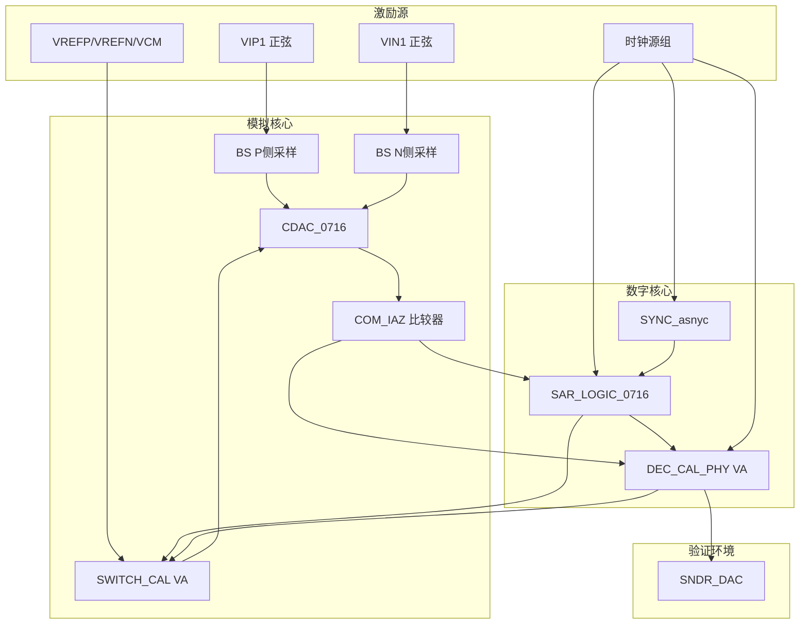
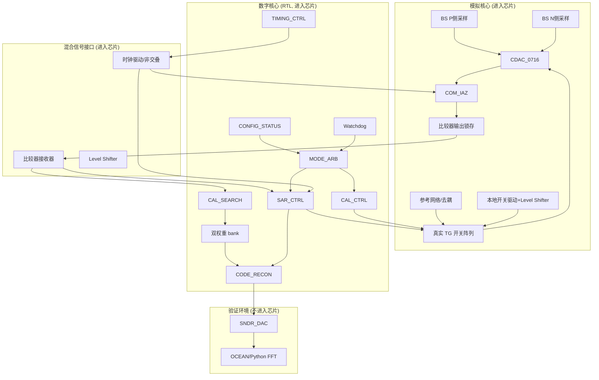
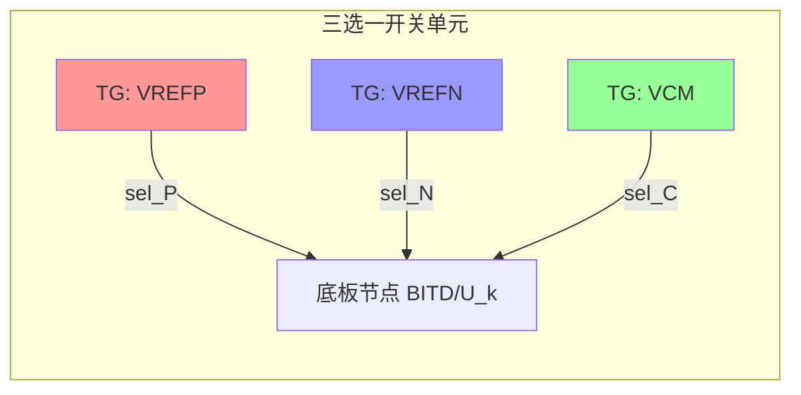
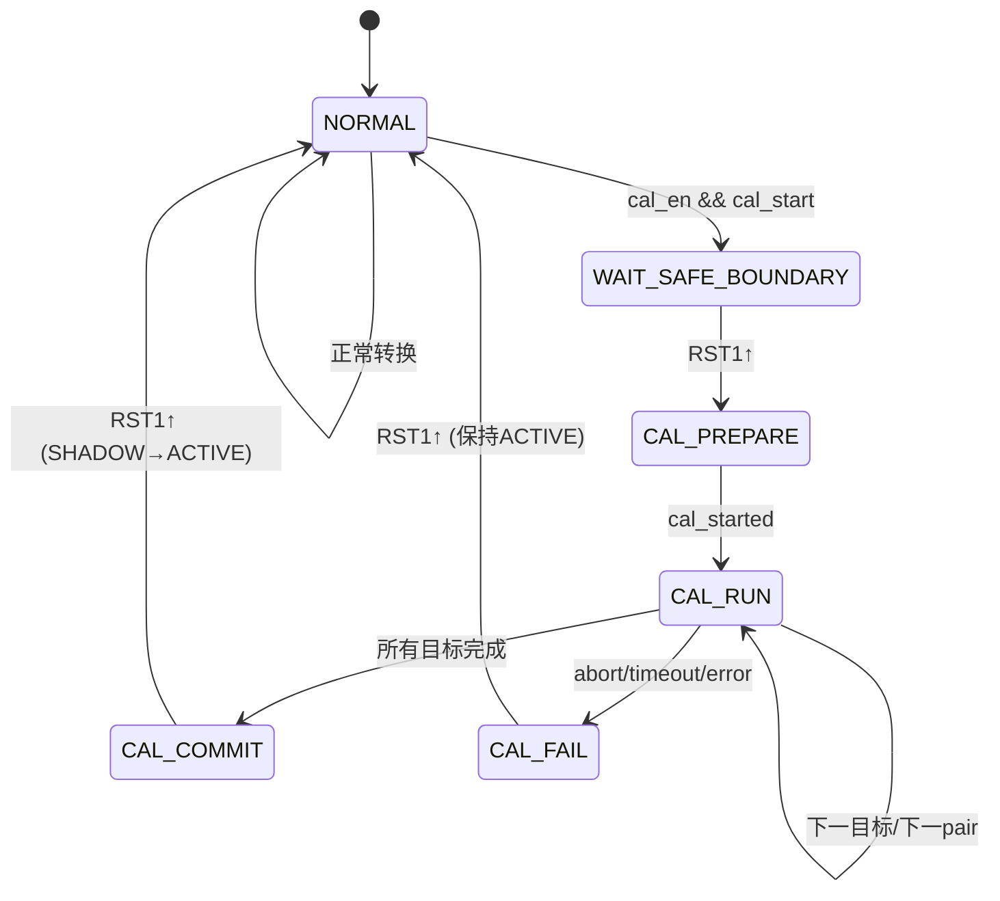
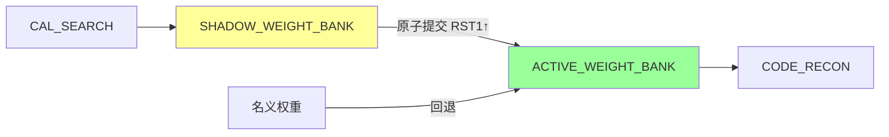

# 0716 SAR ADC 数字—模拟分区、校准控制与真实开关实现报告

> **项目**: `test_12bit50MSAR_AMS_final_0716`
> **ADC 类型**: 12-bit 非二进制冗余 SAR ADC
> **采样率**: 10 MS/s
> **工艺**: TSMC 0.18μm RF CMOS
> **日期**: 2026-07-17

---

## 证据分级说明

本报告中所有关键结论严格标记为以下三类：

| 标记 | 含义 |
|------|------|
| **[已验证]** | 由网表、代码、仿真波形、日志或审计报告直接支持 |
| **[工程推断]** | 由现有结构推导，但尚未完成晶体管级或版图级验证 |
| **[设计建议]** | 拟采用的改进方案，尚未实现或验证 |

---

## 第 1 章：摘要与结论

### 1.1 项目目标

本项目 `test_12bit50MSAR_AMS_final_0716` 是一个 12-bit 非二进制冗余 SAR ADC，采样率 10 MS/s，采用 TSMC 0.18μm RF CMOS 工艺。当前状态为：校准闭环已通过 Verilog-A/Spectre 验证，在确定性电容失配条件下校准后 SNDR 达到 73.24 dB（ENOB 11.874 bit），但 `SWITCH_CAL` 与 `DEC_CAL_PHY` 仍是混合行为模型，需要进一步拆分为真实模拟开关、混合信号接口和可综合数字逻辑，以完成 ASIC 落地。

### 1.2 当前已验证结果

以下结果由完整晶体管级 Spectre 仿真直接支持 **[已验证]**：

| 指标 | 旁路模式 | 校准模式 | 说明 |
|------|----------|----------|------|
| SNDR | -5.17 dB | 73.24 dB | 128 点相干采样，无窗 |
| SFDR | 3.35 dB | 82.22 dB | |
| ENOB | 0 bit | 11.874 bit | |
| DONE | N/A | 1.8 V (有效) | 校准完成标志 |
| ERR | N/A | 0 V (无错误) | 校准错误标志 |

- 仿真条件：`va=800m`，`C=4f`，`fs=10MHz`，`fin=4.609375MHz`（bin 59），`NFFT=128`，相干采样
- 关键参数变更：`NORMALIZE_REDUNDANT_RANGE=0`（偏移模式），`HIGH_WEIGHT_UPDATE_DEADBAND_LSB=1.0`（高位窄死区）
- Spectre 命令行添加 `+preset=cx` 以确保收敛一致性

### 1.2.1 Phase 0 离线验证结果

通过 Phase 0 离线 RAW 重映射实验，已验证 NORMALIZE 假设的根因分析 **[已验证]**：

| 映射方式 | SNDR (dB) | 与 offset-only 差异 | 结论 |
|----------|-----------|---------------------|------|
| V_OUT 直接 FFT（模拟域基准） | 73.24 | — | 最可信 SNDR |
| 浮点 Code 反推（不 round） | 73.24 | 0.00 | 精确恢复，确认 73.24 为真实 SNDR |
| y1: offset-only 浮点 (`Code=raw-128`) | 73.24 | 基准 | 当前模式，最优 |
| y2: normalize + 整数化 (`Code=round(4095*raw/4351)`) | 70.35 | **-2.89 dB** | 再量化噪声是 SNDR 损失主因 |
| y3: normalize 浮点 (不舍入) | 73.24 | 0.00 dB | 线性增益不影响 SNDR |
| 整数 Code 反推（round，对照组） | 70.88 | -2.36 | round() 引入 ±0.5 LSB 量化伪影 |

**关键结论** **[已验证]**：
- 浮点反推（不 round）与 V_OUT 直接 FFT 完全一致（73.24 dB），确认 73.24 dB 是校准后真实 SNDR
- y3（浮点 normalize）与 y1 SNDR 完全一致（0.00 dB），证明线性增益压缩本身不影响 SNDR
- y2（舍入 normalize）比 y1 低 2.89 dB，证明根因是归一化后再量化为整数码引入的独立量化噪声
- 整数反推 round() 引入 ±0.5 LSB 量化误差（标准差 0.287 LSB），在 128 点 FFT 中损失 2.36 dB，这是反推处理的伪影，不是 ADC 本身噪声
- **校准成功：SNDR = 73.24 dB > 73 dB 目标，DONE=1.8V, ERR=0V**
- **推荐使用 offset-only 模式 (`NORMALIZE_REDUNDANT_RANGE=0`) 已由离线实验确认**

> 注：Phase 0 的核心目的是对比 offset-only vs normalize 的相对 SNDR 差异。round() 对所有序列影响相同，因此相对差异（-2.89 dB）不受影响。绝对 SNDR 应引用浮点反推的 73.24 dB。

### 1.3 当前结构性问题

1. **`SWITCH_CAL` 混合功能** **[已验证]**：当前 Verilog-A 模型同时承担正常/校准模式选择、CDAC 参考选择、顶板采样/复位、校准预充与释放、真实开关行为建模和物理索引映射六项功能，无法直接综合为 RTL 或晶体管级电路。
2. **`DEC_CAL_PHY` 混合功能** **[已验证]**：当前 Verilog-A 模型同时承担校准 FSM、搜索算法、权重更新、错误检测、时钟复用、电压阈值判决、正常码重构和输出电压驱动八项功能，跨越模拟/数字/验证三个域。
3. **比较器接口未离散化** **[已验证]**：`DEC_CAL_PHY` 直接读取 `COMP`/`COMN` 模拟电压差进行判决，最终硬件不能让 RTL 读取模拟电压。
4. **无资源仲裁 FSM** **[工程推断]**：当前 `CAL` 信号同时承担请求、忙、模式和时钟隔离四种语义，缺少正式的 normal/calibration 资源仲裁状态机。
5. **无双权重 bank** **[工程推断]**：校准过程中正常解码可能暴露半更新权重，缺少 ACTIVE/SHADOW 双 bank 原子提交机制。

### 1.4 推荐最终分区

| 域 | 模块 | 说明 |
|----|------|------|
| 模拟核心 | BS, CDAC_0716, COM_IAZ, 参考网络, 真实 TG 开关阵列 | 进入芯片 |
| 数字核心 | MODE_ARB, SAR_CTRL, TIMING_CTRL, CAL_CTRL, CAL_SEARCH, 权重 bank, CODE_RECON, CONFIG_STATUS | 可综合 RTL |
| 混合信号接口 | 比较器接收器, 时钟驱动, level shifter, 本地开关驱动 | 进入芯片 |
| 验证环境 | SNDR_DAC, 理想比较器, OCEAN/Python FFT | 不进入芯片 |

### 1.5 最高优先级改动

1. **P0**: 将 `DEC_CAL_PHY` 的模拟电压阈值检测替换为 `cmp_bit`/`cmp_done` 数字接口
2. **P0**: 将 `SWITCH_CAL` 拆分为数字开关控制器 + one-hot interlock + 本地驱动 + 真实 TG 开关阵列
3. **P0**: 实现 `MODE_ARB` 资源仲裁 FSM，确保 normal/calibration 切换在安全边界发生
4. **P1**: 实现双权重 bank（ACTIVE/SHADOW）原子提交机制
5. **P1**: 将输出归一化从模拟域移至数字域固定点实现

---

## 第 2 章：项目背景与现有 0716 架构

### 2.1 非二进制 CDAC

0716 ADC 采用非二进制冗余 CDAC 架构，P/N 两侧各含 13 个物理电容 + 1 个终端决定。物理电容权重如下 **[已验证]**：

| stage | BP | CDAC 物理端 | 名称 | 物理电容 | 输出权重/LSB |
|-------|-----|------------|------|----------|-------------|
| 0 | 13 | BITD/U13 | C12 | 16C | 2048 |
| 1 | 12 | BITD/U12 | C11 | 8C | 1024 |
| 2 | 11 | BITD/U11 | C10 | 4C | 512 |
| 3 | 10 | BITD/U10 | C9 | 2C | 256 |
| 4 | 9 | BITD/U9 | CR | 2C | 256 |
| 5 | 8 | BITD/U8 | C8 | C | 128 |
| 6 | 7 | BITD/U7 | C7 | 24C | 48 |
| 7 | 6 | BITD/U6 | C6 | 16C | 32 |
| 8 | 5 | BITD/U5 | C5 | 10C | 20 |
| 9 | 4 | BITD/U4 | C4 | 6C | 12 |
| 10 | 3 | BITD/U3 | C3 | 4C | 8 |
| 11 | 2 | BITD/U2 | C2 | 2C | 4 |
| 12 | 1 | BITD/U1 | C1 | C | 2 |
| 13 | 0 | terminal | 终端 | 桥/余项 | 1 |

低位阵列通过桥接电容接入高位顶板。桥接低位阵列总和为 $24+16+10+6+4+2+1=63$，桥接衰减系数为：

$$\alpha = \frac{1}{1+63} = \frac{1}{64}$$

因此低位物理电容在差分输出码域对应 48、32、20、12、8、4、2 LSB；终端决定补足 1 LSB **[已验证]**。

### 2.2 冗余支路

冗余 2C 支路（CR，stage 4）使高位序列由严格二进制的 $2048, 1024, 512, 256, 128$ 变成 $2048, 1024, 512, 256, 256, 128$，提供 256 LSB 的数字覆盖区 **[已验证]**。

名义非二进制权重总和为：

$$W_\Sigma = 2048 + 1024 + 512 + 256 + 256 + 128 + 48 + 32 + 20 + 12 + 8 + 4 + 2 + 1 = 4351$$

比标准 12 位满量程 4095 多出冗余 256 LSB（$\pm 128$ LSB 每端）。

冗余的主要价值不是自动消除失配，而是让后续决定可修正前一决定附近的过冲、比较器延迟和小幅 DAC 误差 **[已验证]**。

### 2.3 物理权重和 BP 顺序

0716 顶层 PN 缓冲把 `BITP<13>` 送到 `BP<13>`，依次到 `BP<0>`。`BP<13>` 是首个 C12 决策（MSB），`BP<0>` 是终端决定。`DEC_CAL_PHY` 在 `SOUT` 上升沿锁存 `BP` 时显式反转总线：`r0 = BP[13]`, `r1 = BP[12]`, ..., `r13 = BP[0]`，使 `w0` 对应 C12 权重，`w13` 对应终端 **[已验证]**。

### 2.4 正常转换路径

正常转换的信号链为 **[已验证]**：

```
VIP/VIN → BS(采样) → CDAC_0716(电荷重分配) → COM_IAZ(比较器)
    → SAR_LOGIC_0716(14级决策) → BP<13:0> → DEC_CAL_PHY(SOUT锁存+权重求和)
    → Bit<11:0> → SNDR_DAC(测试用DAC) → OUT
```

每 100 ns 完成一次完整转换。`PRST` 在帧起始预置 SAR 链，`RST`/`RST1` 控制采样和比较器复位窗口，`SOUT` 标记原始决策有效，`CLK00` 标记正常 SAR 窗口。

### 2.5 校准路径

校准路径在 `DEC_CAL_PHY` 控制下，复用同一套 CDAC 和比较器 **[已验证]**：

```
DEC_CAL_PHY → BITD_CAL/BITU_CAL → SWITCH_CAL → CDAC_0716(校准激励)
    → COM_IAZ(比较器) → DEC_CAL_PHY(CMP/COMN读取)
    → 权重更新 → SOUT正常解码(使用校准后权重)
```

校准时序以每 100 ns 帧为原子单位。`RST1` 上升沿清除帧状态，`RST1` 下降沿打开新帧。`CAL_CLK` 在帧内提供 8 次有效比较周期。6 个目标 × 8 pair × 2 侧 = 96 帧，理论前景时间约 9.6 μs **[已验证]**。

---

## 第 3 章：现有模块审计

### 3.1 BS（自举采样开关）

| 属性 | 内容 |
|------|------|
| 当前实现 | 晶体管级 subckt（nch/pch/mimcap） |
| 当前功能 | 自举采样开关，CLK 控制采样/保持 |
| 模拟/数字 | 纯模拟 |
| 现有风险 | 无自举电容充电保证；采样线性度依赖晶体管尺寸 |
| 最终去向 | 模拟核心，进入芯片 |
| 是否可综合 | N/A（模拟电路） |
| 是否需要重构 | 否（当前实现已是真实晶体管级） |

**端口** **[已验证]**：

| 端口 | 方向 | 功能 |
|------|------|------|
| AGND, AVDD | 电源 | 模拟电源与地 |
| CLK | 输入 | 采样时钟（CLK0 的反相） |
| VIN | 输入 | 采样输入（VIP1 或 VIN1） |
| VOUT | 输出 | 采样输出（VIP 或 VIN） |

两个实例：`I55` 采样 VIP1→VIP，`I54` 采样 VIN1→VIN **[已验证]**。

### 3.2 CDAC_0716（电容 DAC）

| 属性 | 内容 |
|------|------|
| 当前实现 | 晶体管级 subckt（capacitor） |
| 当前功能 | P/N 两侧差分电容阵列，含桥接低位阵列 |
| 模拟/数字 | 纯模拟 |
| 现有风险 | 电容失配（C12: +5.81 LSB, C11: +3.82 LSB, C10: +1.12 LSB） |
| 最终去向 | 模拟核心，进入芯片 |
| 是否可综合 | N/A |
| 是否需要重构 | 否（电容阵列本身不需要修改） |

**电容映射** **[已验证]**：

| 电容编号 | P 侧节点 | N 侧节点 | 电容值 | 对应权重 |
|----------|----------|----------|--------|----------|
| C143 | BITD<13> | — | 16C | C12 |
| C156 | — | BITU<13> | 16C | C12 |
| C141 | BITD<12> | — | 8C | C11 |
| C154 | — | BITU<12> | 8C | C11 |
| C142 | BITD<11> | — | 4C | C10 |
| C155 | — | BITU<11> | 4C | C10 |
| C139 | BITD<10> | — | 2C | CR |
| C152 | — | BITU<10> | 2C | CR |
| C248 | BITD<9> | — | 2C | C9 |
| C249 | — | BITU<9> | 2C | C9 |
| C140 | BITD<8> | — | C | C8 |
| C153 | — | BITU<8> | C | C8 |
| C138/C151 | net3/net4 | BITD<7>/BITU<7> | 24C | C7 |
| C137/C150 | net3/net4 | BITD<6>/BITU<6> | 16C | C6 |
| C136/C149 | net3/net4 | BITD<5>/BITU<5> | 10C | C5 |
| C132/C157 | net3/net4 | BITD<4>/BITU<4> | 6C | C4 |
| C135/C148 | net3/net4 | BITD<3>/BITU<3> | 4C | C3 |
| C134/C147 | net3/net4 | BITD<2>/BITU<2> | 2C | C2 |
| C133/C146 | net3/net4 | BITD<1>/BITU<1> | C | C1 |
| C144/C145 | P/N | net3/net4 | C | 桥接电容 |

### 3.3 COM_IAZ（比较器）

| 属性 | 内容 |
|------|------|
| 当前实现 | 晶体管级 subckt（pch_mis, nch_mis, INVX2, NOR1） |
| 当前功能 | 动态比较器，含 IAZ（Auto-Zero）复位机制 |
| 模拟/数字 | 模拟（输出为模拟电压 VON/VOP） |
| 现有风险 | RST 高期间 VON/VOP 保持旧值（stale output）；无 timeout 保护 |
| 最终去向 | 模拟核心，进入芯片 |
| 是否可综合 | N/A |
| 是否需要重构 | 是（需添加数字输出接口 cmp_bit/cmp_done） |

**端口** **[已验证]**：

| 端口 | 方向 | 功能 |
|------|------|------|
| AGND, AVDD | 电源 | 模拟电源与地 |
| CLK | 输入 | 比较器评估时钟 |
| RST | 输入 | 复位/IAZ 控制 |
| VIN, VIP | 输入 | 差分输入（CDAC 顶板 N/P） |
| VON, VOP | 输出 | 差分模拟输出（顶层命名 COMN/COMP） |

**关键时序行为** **[已验证]**：
- RST 为高时：输出保持上一次决定（stale latch），不能作为新比较结果采样
- RST 为低时：CLK 上升沿触发评估，可连续给出 8 次可靠比较
- 正/负 20 mV 输入差分时输出极性已验证

### 3.4 SAR_LOGIC_0716（SAR 决策链）

| 属性 | 内容 |
|------|------|
| 当前实现 | 晶体管级 subckt（DFF, NOR1, NAND1, INVX1/2） |
| 当前功能 | 14 级非二进制 SAR 决策链，产生 BITP/BITN<13:0> 互补输出和 SET<0:13> 逐级控制 |
| 模拟/数字 | 数字（但当前为晶体管级实现） |
| 现有风险 | 物理顺序与 stage 顺序的映射在 SWITCH_CAL 中用 13-k 完成 |
| 最终去向 | 数字核心（可综合 RTL） |
| 是否可综合 | 是（逻辑等价 RTL） |
| 是否需要重构 | 是（迁移为 RTL，添加 cmp_bit/cmp_done 接口） |

**端口** **[已验证]**：

| 端口组 | 方向 | 功能 |
|--------|------|------|
| BITN/P<13:0> | 输出 | 14 级互补决策输出 |
| CCLK | 输入 | SAR 链时钟 |
| COMN | 输入 | 比较器决定输入 |
| PRST | 输入 | 整帧预置 |
| SET<0:13> | 输出 | 逐级置位控制 |
| DGND, DVDD | 电源 | 数字电源与地 |

**关键映射** **[已验证]**：`SET<0>` 对应 C12（物理 13），`SET<13>` 对应终端。`BITP<13>` 对应 C12 决策，`BITP<0>` 对应终端决策。stage 索引与物理索引的关系为 `stage = 13 - physical_index`。

### 3.5 SYNC_asnyc（异步同步器）

| 属性 | 内容 |
|------|------|
| 当前实现 | 晶体管级 subckt（INVX1/3, NOR1, NAND1, not_gate） |
| 当前功能 | 产生 CCLK（SAR 链时钟）、CLK00（正常窗口标记）、DEC_N（有效/完成路径） |
| 模拟/数字 | 数字 |
| 现有风险 | CLK 来自 DEC_CAL_PHY 的 normal/calibration 时钟选择，存在多源时钟语义 |
| 最终去向 | 数字核心（TIMING_CTRL 的一部分） |
| 是否可综合 | 是 |
| 是否需要重构 | 是（时钟选择逻辑需移入 MODE_ARB） |

**端口** **[已验证]**：

| 端口 | 方向 | 功能 |
|------|------|------|
| CCLK | 输出 | SAR 链时钟 |
| CLK | 输入 | 来自 DEC_CAL_PHY 的时钟选择 |
| CLK00 | 输出 | 正常 SAR 窗口标记 |
| COMN, COMP | 输入 | 比较器输出 |
| DEC_N | 输出 | 有效/完成路径 |
| SET<12> | 输入 | 最后有效级完成反馈 |

### 3.6 SWITCH_CAL（校准感知 CDAC 开关）

| 属性 | 内容 |
|------|------|
| 当前实现 | Verilog-A 行为模型（tanh 平滑开关） |
| 当前功能 | 正常/校准模式选择、CDAC 参考选择、顶板采样/复位、校准预充与释放、真实开关行为建模、物理索引映射 |
| 模拟/数字 | 混合（模拟开关 + 数字模式选择 + 校准控制） |
| 现有风险 | 六项功能混合在同一模块；无法综合；tanh 开关非真实晶体管 |
| 最终去向 | 拆分：数字控制器→RTL，本地驱动+TG→模拟核心 |
| 是否可综合 | 否（当前为 VA） |
| 是否需要重构 | 是（核心重构对象） |

**端口** **[已验证]**：

| 端口组 | 方向 | 功能 |
|--------|------|------|
| AGND, AVDD | 电源 | 模拟电源 |
| BITD/U<1:13> | 双向 | CDAC 物理底板节点（P/N 两侧） |
| BITN/P<0:13> | 输入 | 正常 SAR 决策 |
| N, P | 双向 | 比较器输入顶板 |
| RST, RST1 | 输入 | 采样/顶板复位和比较器帧窗口 |
| SET<0:12> | 输入 | 逐级置位控制 |
| VCM, VIN, VIP, VREFN, VREFP | 双向 | 顶板采样与底板参考 |
| BITD/U_CAL<0:12> | 输入 | 校准激励掩码（stage 顺序） |
| CAL, CAL_CLK | 输入 | 模式选择和校准子时钟 |

**功能拆分分析** **[已验证]**：

当前 `SWITCH_CAL` 同时承担以下功能：

1. **正常/校准模式选择**：`s_cal = logic_level(V(CAL))` 控制 `s_norm = 1 - s_cal`
2. **CDAC 参考选择逻辑**：每个底板节点三选一（VREFP/VREFN/VCM），通过 `SET`、`BITP/N` 和 `NORMAL_REF_SWAP` 组合
3. **顶板采样/复位**：`s_top_pre = s_norm * s_rst11 + s_cal * (1 - s_cal_clk)` 控制 P/N 到 VCM 的开关
4. **校准预充与释放**：`pair_pos`/`pair_neg`/`pair_cm` 函数控制差分校准激励
5. **真实开关行为建模**：tanh 平滑函数模拟开关导通/关断电阻
6. **物理索引映射**：`13-k` 将 stage 索引映射到物理电容索引

### 3.7 DEC_CAL_PHY（校准解码器/控制器）

| 属性 | 内容 |
|------|------|
| 当前实现 | Verilog-A 行为模型（1031 行） |
| 当前功能 | 校准 FSM、搜索算法、权重更新、错误检测、时钟复用、电压阈值判决、正常码重构、输出驱动 |
| 模拟/数字 | 混合（数字 FSM + 模拟电压读取 + 测试 DAC 驱动） |
| 现有风险 | 八项功能混合；直接读取模拟电压；无双权重 bank；无资源仲裁 FSM |
| 最终去向 | 拆分：数字部分→RTL，模拟接口→混合信号接口，输出 DAC→验证环境 |
| 是否可综合 | 否（当前为 VA） |
| 是否需要重构 | 是（核心重构对象） |

**端口** **[已验证]**：

| 端口组 | 方向 | 功能 |
|--------|------|------|
| Bit<11:0> | 输出 | 重构 12 位输出码 |
| BP<0:13> | 输入 | 正常 SAR 原始决策 |
| DGND, DVDD | 电源 | 数字电源 |
| SOUT | 输入 | 上升沿锁存原始决策 |
| COMP, COMN | 输入 | 比较器模拟输出（校准搜索用） |
| RST1, CAL_RST | 输入 | 帧边界和校准启动复位 |
| CLK_SAR, CLK00 | 输入 | 正常 SAR 时钟和窗口 |
| CAL_CLK | 输入 | 校准子时钟 |
| CLK | 输出 | 时钟复用输出 |
| BITD/U_CAL<0:12> | 输出 | 校准激励掩码 |
| CAL, DONE, ERR | 输出 | 模式、完成、错误状态 |

**功能拆分分析** **[已验证]**：

当前 `DEC_CAL_PHY` 同时承担以下功能：

1. **校准模式 FSM**：`cal_mode_i`、`cal_armed_i`、`cal_started_i`、`finish_pending_i` 状态机
2. **目标和 wall 选择**：`target_idx`、`target_mask`、`wall_mask` 递归构造
3. **搜索算法**：phase 0 符号测量 + phase 1 非二进制 SAR 搜索（C7→C1）
4. **镜像测量和平均**：P/D 侧和 N/U 侧各测一次，8 pair 平均
5. **权重更新**：`candidate_weight = wall_weight + 2*residual_avg`，deadband 保护
6. **错误检测**：`WEIGHT_TOL` 范围检查、`saturation_i` 检测、`MAX_INVALID` 超限
7. **时钟复用**：`CLK = (1-cal_mode)*CLK_SAR + cal_mode*(CAL_CLK * frame_active * cal_started * (1-finish_pending))`
8. **电压阈值判决**：`cmp_delta = V(COMP) - V(COMN)`，`CMP_VALID_FRACTION` 判断有效性
9. **正常码重构**：`raw_sum = Σ r_i * w_i`，归一化/偏移，输出 `Bit<11:0>`
10. **输出电压驱动**：`V(Bit[k]) = vlogic * transition(b_k)` 驱动 SNDR_DAC

### 3.8 SNDR_DAC（测试用 DAC）

| 属性 | 内容 |
|------|------|
| 当前实现 | Verilog-A/原理图混合（vcvs 级联 + not_gate 缓冲） |
| 当前功能 | 将 12 位数字码转换为理想模拟电压，专用于动态性能测量 |
| 模拟/数字 | 混合（数字输入→模拟输出） |
| 现有风险 | 不参与物理 CDAC 反馈，仅用于测试 |
| 最终去向 | 验证环境，不进入芯片 |
| 是否可综合 | N/A（测试电路） |
| 是否需要重构 | 否 |

**端口** **[已验证]**：`Bit<11:0>` 输入，`OUT` 输出（0~3.5V 满量程），`AGND` 参考。

输出电压公式 **[已验证]**：

$$V_{OUT} = V_{ref} \sum_{k=0}^{11} \frac{B_k}{2^{k+1}} \times 2$$

其中 $V_{ref} = 1.8$ V，$B_k$ 为 Bit<11:0> 的第 k 位。

---

## 第 4 章：模拟、数字、混合接口和验证环境的正式分区

### 4.1 当前系统框图



**图 4-1：当前 0716 SAR ADC 系统框图** **[已验证]**

### 4.2 推荐最终系统框图



**图 4-2：推荐最终系统框图** **[设计建议]**

### 4.3 模块归属表

| 模块 | 当前实现 | 当前功能 | 最终归属 | 是否可综合 | 是否进入芯片 | 是否需要重构 |
|------|----------|----------|----------|------------|-------------|-------------|
| BS | 晶体管级 | 自举采样开关 | 模拟核心 | N/A | 是 | 否 |
| CDAC_0716 | 晶体管级 | 电容 DAC 阵列 | 模拟核心 | N/A | 是 | 否 |
| COM_IAZ | 晶体管级 | 动态比较器 | 模拟核心 | N/A | 是 | 是（添加数字输出） |
| SAR_LOGIC_0716 | 晶体管级 | SAR 决策链 | 数字核心 | 是（RTL） | 是 | 是（迁移 RTL） |
| SYNC_asnyc | 晶体管级 | 时钟同步 | 数字核心 | 是（RTL） | 是 | 是（拆入 TIMING_CTRL） |
| SWITCH_CAL | Verilog-A | 校准感知开关 | 拆分：数字+模拟 | 部分 | 是 | 是（核心重构） |
| DEC_CAL_PHY | Verilog-A | 校准解码器 | 拆分：数字+验证 | 部分 | 是 | 是（核心重构） |
| SNDR_DAC | 混合 | 测试 DAC | 验证环境 | N/A | 否 | 否 |

### 4.4 电源域

| 电源域 | 电压 | 供电对象 | 隔离要求 |
|--------|------|----------|----------|
| AVDD/AGND | 1.8 V | BS, CDAC, COM_IAZ, 参考网络, TG 开关 | 模拟岛隔离 |
| DVDD/DGND | 1.8 V | SAR_LOGIC, SYNC, DEC_CAL_PHY (数字部分) | 数字噪声隔离 |
| VREFP | 1.8 V | CDAC 正参考 | 去耦 + 局部缓冲 |
| VREFN | 0 V | CDAC 负参考 | 低阻抗地 |
| VCM | 0.9 V | CDAC 共模/顶板复位 | 低阻抗缓冲 |

### 4.5 时钟域

| 时钟 | 频率 | 来源 | 用途 | 安全切换条件 |
|------|------|------|------|-------------|
| CLK0 | 10 MHz | 外部 | BS 采样时钟 | — |
| RST | 10 MHz | 外部 | 采样/比较器复位 | — |
| RST1 | 10 MHz | 外部 | 比较器帧窗口 | — |
| PRST | 10 MHz | 外部 | SAR 链预置 | — |
| SOUT | 10 MHz | 外部 | 原始决策锁存 | — |
| CLK00 | 10 MHz | SYNC_asnyc | 正常 SAR 窗口 | — |
| CCLK | 10 MHz | SYNC_asnyc | SAR 链时钟 | 仅正常模式有效 |
| CAL_CLK | 100 MHz | 外部 | 校准子时钟 | 仅校准模式有效 |
| CLK | 10 MHz | DEC_CAL_PHY 复用 | 比较器时钟 | 在 RST1 上升沿切换 |

### 4.6 数据域

| 数据总线 | 位宽 | 方向 | 编码 | 物理意义 |
|----------|------|------|------|----------|
| BP<13:0> | 14 | SAR→DEC | 一热码 | 14 级 SAR 原始决策 |
| BITP/N<13:0> | 14×2 | SAR→SWITCH | 一热码 | 物理索引顺序 |
| SET<0:13> | 14 | SAR→SWITCH | 逐级脉冲 | 逐级置位控制 |
| BITD/U<1:13> | 13×2 | SWITCH↔CDAC | 物理节点 | 底板参考选择 |
| BITD/U_CAL<0:12> | 13×2 | DEC→SWITCH | stage 顺序 | 校准激励掩码 |
| Bit<11:0> | 12 | DEC→SNDR_DAC | 二进制 | 重构输出码 |
| w0..w13 | 14×Q4 | DEC 内部 | Q4 定点 | 校准权重 |

---

## 第 5 章：真实 CDAC 开关阵列设计

### 5.1 开关单元

每个物理 CDAC 底板节点使用一套三选一参考开关 **[设计建议]**：

- `VREFP`：正参考（1.8 V）
- `VREFN`：负参考（0 V）
- `VCM`：共模（0.9 V）

建议采用 CMOS transmission gate（TG）实现。数字控制必须经过 one-hot interlock 和 break-before-make 保护。

**逻辑约束** **[设计建议]**：

$$sel_{P,i} + sel_{N,i} + sel_{C,i} \leq 1$$

正常稳定状态下：

$$sel_{P,i} + sel_{N,i} + sel_{C,i} = 1$$

切换死区允许三者短暂为 0，但禁止任意两个同时为 1。

**CDAC one-hot 合法状态表** **[设计建议]**：

| 状态 | sel_P | sel_N | sel_C | 含义 | 允许 |
|------|-------|-------|-------|------|------|
| REF_P | 1 | 0 | 0 | 接 VREFP | 是 |
| REF_N | 0 | 1 | 0 | 接 VREFN | 是 |
| CM | 0 | 0 | 1 | 接 VCM | 是 |
| FLOAT | 0 | 0 | 0 | 切换死区 | 仅瞬态 |
| ILLEGAL_1 | 1 | 1 | 0 | — | 禁止 |
| ILLEGAL_2 | 1 | 0 | 1 | — | 禁止 |
| ILLEGAL_3 | 0 | 1 | 1 | — | 禁止 |
| ILLEGAL_4 | 1 | 1 | 1 | — | 禁止 |



**图 5-1：CDAC 三选一真实开关单元** **[设计建议]**

### 5.2 模式选择原则

**禁止**在模拟信号路径中额外串联一个 normal/calibration 模拟 MUX **[设计建议]**。

必须采用以下结构：

```text
normal control ─┐
                ├─ digital owner mux ─ one-hot interlock ─ local driver ─ 同一套真实 TG
cal control ────┘
```

正常转换与校准必须复用同一套物理开关，以避免 **[设计建议]**：

- 串联电阻增加
- 两种模式寄生不一致
- 校准权重与正常转换权重不一致
- 额外电荷注入
- 版图不对称

**normal/calibration 控制真值表** **[设计建议]**：

| CAL | owner | sel_P 来源 | sel_N 来源 | sel_C 来源 | 说明 |
|-----|-------|-----------|-----------|-----------|------|
| 0 | normal | SET, BITP/N | SET, BITP/N | SET 反相 | 正常 SAR 转换 |
| 1 | cal | BITD/U_CAL pair_pos | BITD/U_CAL pair_neg | BITD/U_CAL pair_cm | 校准激励 |

### 5.3 开关尺寸分析

报告给出尺寸设计方法，而非固定宽度 **[设计建议]**。

**关键参数**：

$$R_{on}, \quad C_{par}, \quad Q_{inj}, \quad t_{settle}$$

对于目标建立误差，使用：

$$e^{-t_{settle}/\tau} < \varepsilon$$

其中 12-bit、0.25 LSB 的理想一阶约束可写为：

$$\varepsilon < \frac{1}{4 \cdot 2^{12}} = \frac{1}{16384} \approx 6.1 \times 10^{-5}$$

从而得到：

$$\frac{t_{settle}}{\tau} > \ln(16384) \approx 9.7$$

**该公式仅作为初始预算** **[设计建议]**。最终需以完整多节点 CDAC + 参考网络 PVT/post-layout 建立仿真签核。

**当前 VA 模型参数参考** **[已验证]**：

| 参数 | 当前值 | 说明 |
|------|--------|------|
| RON_SAMPLE | 5 Ω | 采样开关导通电阻 |
| RON_REF | 10 Ω | 参考开关导通电阻 |
| RON_TOP | 5 Ω | 顶板开关导通电阻 |
| ROFF | 1×10¹⁵ Ω | 关断电阻 |
| VSMOOTH | 10 mV | tanh 平滑过渡宽度 |
| TD_RSTT | 200 ps | RST 延迟 |
| TD_RST11 | 200 ps | RST1 延迟 |
| TCLK_EDGE | 10 ps | 时钟边沿 |

**TG 开关尺寸估算** **[工程推断]**：

对于 TSMC 0.18μm 工艺，给定 $R_{on} = 10$ Ω 的目标，TG 的等效导通电阻约为：

$$R_{on,TG} \approx \frac{1}{\mu_n C_{ox} (W/L)_n (V_{GS} - V_{TH})} \parallel \frac{1}{\mu_p C_{ox} (W/L)_p (V_{SG} - V_{TH})}$$

在 1.8 V 电源、0.5 V 过驱动下，NMOS 的 $W/L$ 约需 50~100，PMOS 约需 150~200（补偿空穴迁移率）。具体尺寸需结合 PDK 参数和版图寄生最终确定。

### 5.4 版图约束

- P/N 两侧开关阵列严格对称布线 **[设计建议]**
- 每个开关单元的 VREFP/VREFN/VCM 布线长度匹配 **[设计建议]**
- 参考布线使用低阻金属层（顶层金属）**[设计建议]**
- guard ring 包围模拟岛，隔离数字噪声 **[设计建议]**
- 电容阵列采用共质心布局 **[设计建议]**

---

## 第 6 章：数字控制器架构

### 6.1 MODE_ARB（模式仲裁器）

**功能** **[设计建议]**：管理系统在正常转换和校准模式之间的切换，确保资源切换仅在安全边界发生。

**外部控制接口** **[设计建议]**：

| 信号 | 方向 | 功能 |
|------|------|------|
| cal_en | 输入 | 校准使能（外部配置） |
| cal_start | 输入 | 校准启动请求（上升沿触发） |
| cal_abort | 输入 | 校准中止请求（异步） |
| cal_reset | 输入 | 校准模块硬复位 |
| cal_busy | 输出 | 校准进行中 |
| cal_done | 输出 | 校准完成（有效高，锁存） |
| cal_err | 输出 | 校准错误（有效高，锁存） |
| cal_valid | 输出 | 当前权重有效 |
| cal_active | 输出 | 校准拥有 CDAC 所有权 |

**状态转移表** **[设计建议]**：

| 当前状态 | 条件 | 下一状态 | 动作 |
|----------|------|----------|------|
| NORMAL | cal_en=1 && cal_start=1 | WAIT_SAFE_BOUNDARY | 准备进入校准 |
| NORMAL | — | NORMAL | 正常转换 |
| WAIT_SAFE_BOUNDARY | RST1↑ | CAL_PREPARE | 在安全边界切换所有权 |
| CAL_PREPARE | cal_started=1 | CAL_RUN | 初始化目标/wall |
| CAL_RUN | 所有目标完成 | CAL_COMMIT | 提交权重 |
| CAL_RUN | cal_abort=1 | CAL_FAIL | 中止校准 |
| CAL_RUN | timeout=1 | CAL_FAIL | 超时中止 |
| CAL_RUN | MAX_INVALID | CAL_FAIL | 错误超限 |
| CAL_COMMIT | RST1↑ | NORMAL | 原子提交 SHADOW→ACTIVE |
| CAL_FAIL | RST1↑ | NORMAL | 丢弃 SHADOW，保持 ACTIVE |



**图 6-1：MODE_ARB 状态机** **[设计建议]**

**安全边界定义** **[设计建议]**：建议以 `RST1` 上升沿（比较器/CDAC reset 窗口开始）作为安全边界。此时比较器输出无效、CDAC 顶板已复位，资源切换不会影响正在进行的转换。

### 6.2 SAR_CTRL（SAR 控制器）

**功能** **[设计建议]**：替代当前 `SAR_LOGIC_0716` 的决策链功能，使用 `cmp_bit`/`cmp_done` 数字接口代替直接模拟电压输入。

**接口** **[设计建议]**：

| 信号 | 方向 | 功能 |
|------|------|------|
| cmp_bit | 输入 | 比较器决策结果（1=正, 0=负） |
| cmp_done | 输入 | 比较器完成脉冲 |
| cclk | 输入 | SAR 链时钟 |
| prst | 输入 | 帧预置 |
| raw<13:0> | 输出 | 14 级原始决策（stage 顺序） |
| set<0:13> | 输出 | 逐级置位控制 |
| raw_valid | 输出 | 原始决策有效 |

**与当前实现差异** **[已验证]**：
- 当前 `SAR_LOGIC_0716` 直接接收 `COMN` 模拟信号
- 最终实现接收 `cmp_bit`（数字化后的比较器结果）
- 决策链逻辑不变：DFF + NOR1 + NAND1 结构等价为标准 SAR shift-register + decision-DFF

### 6.3 TIMING_CTRL（时序控制器）

**功能** **[设计建议]**：替代当前 `SYNC_asnyc`，产生所有时序控制信号。时钟选择逻辑由 MODE_ARB 控制。

**接口** **[设计建议]**：

| 信号 | 方向 | 功能 |
|------|------|------|
| clk_sar | 输入 | 正常 SAR 时钟 |
| cal_clk | 输入 | 校准子时钟 |
| mode_normal | 输入 | 模式选择（来自 MODE_ARB） |
| clk_out | 输出 | 复用后的比较器时钟 |
| cclk | 输出 | SAR 链时钟 |
| clk00 | 输出 | 正常 SAR 窗口标记 |
| rst1_edge | 输出 | RST1 上升沿检测（安全边界标记） |

**关键约束** **[工程推断]**：时钟切换必须在 RST1 上升沿发生，确保不在比较器评估期间切换。

### 6.4 CAL_CTRL（校准控制器）

**功能** **[设计建议]**：管理校准目标序列、pair 循环和帧计数。替代 `DEC_CAL_PHY` 中的 `target_idx`、`pair_idx`、`trial_idx` 逻辑。

**校准目标序列** **[已验证]**：

| 序号 | target_idx | 目标电容 | wall 构造 | 名义权重 |
|------|-----------|----------|-----------|----------|
| 0 | 0 | C12 | 空 wall | 2048 |
| 1 | 1 | C11 | {w0} | 1024 |
| 2 | 2 | C10 | {w0,w1} | 512 |
| 3 | 3 | C9 | {w0,w1,w2} | 256 |
| 4 | 4 | CR | {w0,w1,w2,w3} | 256 |
| 5 | 5 | C8 | {w0,w1,w2,w3,w4} | 128 |

每个目标执行 8 pair × 2 侧 = 16 次测量。总帧数 = 6 × 16 = 96 帧 **[已验证]**。

### 6.5 CAL_SEARCH（校准搜索引擎）

**功能** **[设计建议]**：执行相位 0 符号测量和相位 1 非二进制 SAR 搜索。

**搜索算法** **[已验证]**：

Phase 0（符号测量）：
1. 将目标电容设为 VREFP，wall 设为 VREFN
2. 比较器评估方向
3. 根据方向决定后续搜索极性

Phase 1（非二进制搜索 C7→C1）：
1. 从 C7 开始，依次测试 C6、C5、C4、C3、C2、C1
2. 每级根据比较器结果保留或撤销
3. 搜索完成后计算 residual_avg

**residual 计算** **[已验证]**：

$$q_{residual} = \sum_{k=1}^{7} r_k \cdot w_k^{search}$$

$$residual\_avg = \frac{1}{N_{pair} \times 2} \sum_{pair=0}^{N_{pair}-1} (q_P + q_N)$$

其中 $N_{pair} = 2^{AVG\_PAIRS\_LOG2} = 8$，P/N 两侧各测一次。

### 6.6 双权重 bank

**ACTIVE_WEIGHT_BANK** **[设计建议]**：
- 存储当前有效的 14 个权重值（w0~w13，每个 Q4.16 格式）
- 校准期间只读
- 正常解码使用此 bank

**SHADOW_WEIGHT_BANK** **[设计建议]**：
- 校准搜索结果写入此 bank
- 校准成功后在安全边界原子提交到 ACTIVE
- 校准失败时丢弃



**图 6-2：双权重 bank 提交流程** **[设计建议]**

**回退策略** **[设计建议]**：
- 校准失败时丢弃 SHADOW，ACTIVE 保持旧值
- 若无旧有效值，则回退名义权重：w0=2048, w1=1024, ..., w13=1
- 同时置 `cal_err=1`

### 6.7 CODE_RECON（码域重构器）

**功能** **[设计建议]**：将 14 级原始决策与 ACTIVE 权重加权求和，输出 12 位二进制码。

**算法** **[已验证]**：

$$raw\_sum = \sum_{i=0}^{13} r_i \cdot w_i$$

当 `NORMALIZE_REDUNDANT_RANGE=0`（偏移模式）：

$$Code = raw\_sum - 128$$

当 `NORMALIZE_REDUNDANT_RANGE=1`（归一化模式）：

$$Code = \left\lfloor \frac{4095 \cdot raw\_sum}{W_\Sigma} \right\rfloor$$

**推荐使用偏移模式** **[已验证]**：归一化模式引入 0.527 dB 增益压缩和约 2.89 dB 再量化噪声（Phase 0 离线实测值），而偏移模式仅产生恒定 -128 LSB 偏移（可数字校正）。Phase 0 离线 RAW 重映射实验确认：浮点归一化（不舍入）与 offset-only 的 SNDR 完全一致（0.00 dB），证明线性增益压缩本身不影响 SNDR；SNDR 损失的根因是归一化后再量化为整数码引入的独立量化噪声。

### 6.8 CONFIG_STATUS（配置与状态寄存器）

**配置寄存器** **[已验证]**：

| 参数 | 地址 | 默认值 | 说明 |
|------|------|--------|------|
| CAL_BYPASS | 0x00 | 0 | 0=校准模式, 1=旁路 |
| NORMALIZE_REDUNDANT_RANGE | 0x01 | 0 | 0=偏移, 1=归一化 |
| REMOVE_REDUNDANT_OFFSET | 0x02 | 1 | 移除冗余偏移 |
| HIGH_WEIGHT_UPDATE_DEADBAND_LSB | 0x03 | 1.0 | C10/C11/C12 死区 |
| UPDATE_DEADBAND_LSB | 0x04 | 2.0 | C8/C9/CR 死区 |
| WEIGHT_TOL | 0x05 | 0.25 | 权重容差（±25%） |
| FRAC_BITS | 0x06 | 4 | 定点小数位 |
| AVG_PAIRS_LOG2 | 0x07 | 3 | 平均 pair 数对数 |
| MAX_CAL_CYCLES | 0x08 | 200 | 校准超时帧数 |
| MAX_INVALID | 0x09 | 5 | 最大无效次数 |
| CMP_VALID_FRACTION | 0x0A | 0.25 | 比较器有效阈值 |
| APPLY_BIN_MIDPOINT | 0x0B | 0 | 强制中点偏移 |
| AUTO_BIN_MIDPOINT | 0x0C | 1 | 自动中点补偿 |
| ZERO_ON_INVALID | 0x0D | 1 | 零残差处理 |

**状态寄存器** **[设计建议]**：

| 位 | 名称 | 说明 |
|----|------|------|
| [7] | cal_done | 校准完成 |
| [6] | cal_err | 校准错误 |
| [5] | cal_valid | 权重有效 |
| [4] | cal_active | 校准占用 CDAC |
| [3:0] | cal_target_idx | 当前校准目标索引 |

---

## 第 7 章：比较器与数字接口

### 7.1 当前问题

当前 `DEC_CAL_PHY` 通过以下方式读取比较器结果 **[已验证]**：

```verilog
cmp_delta = V(COMP) - V(COMN);
cmp_q = (cmp_delta > CMP_VALID_FRACTION) ? 1 :
        (cmp_delta < -CMP_VALID_FRACTION) ? 0 : -1; // invalid
```

这直接读取模拟电压差，无法在最终 RTL 中实现。最终硬件必须使用数字化的 `cmp_bit` 和 `cmp_done` 信号。

### 7.2 推荐结构

```text
COM_IAZ 动态输出 (VOP/VON)
        ↓
本地静态锁存 / SR latch
        ↓
cmp_bit     (1=VOP>VON, 0=VOP<VON)
cmp_done    (当前比较周期完成脉冲)
```

**图 7-1：比较器接收接口** **[设计建议]**

### 7.3 关键设计要点

| 问题 | 分析 | 解决方案 |
|------|------|----------|
| reset 状态 | RST 高时输出保持旧值 | cmp_done 在 RST 期间不产生 |
| evaluate 状态 | CLK 上升沿触发评估 | cmp_done 在评估完成后产生 |
| stale output 风险 | 上一周期结果残留 | SR latch 在每周期 RST 上升沿清零 |
| 当前周期隔离 | 必须区分当前与上周期结果 | cmp_done 绑定当前周期 |
| timeout | 比较器可能不收敛 | watchdog 计数器，超时后 cmp_done=1, cmp_bit=上一周期值 |
| 亚稳态 | 输入差分极小时 | 双采样或增加再生时间 |
| 输出缓冲负载 | 驱动 RTL 输入 | 两级反相器缓冲 |
| PVT 完成时间 | 温度/工艺变化 | 最坏情况分析，timeout 设为 2× 标称值 |

### 7.4 cmp_done 时序约束

`cmp_done` 必须与当前比较周期绑定，不能仅由两个静态输出当前值组合得到 **[设计建议]**。

**推荐实现** **[设计建议]**：

```verilog
// 伪代码
always @(posedge clk_eval) begin
    if (rst_cmp) begin
        cmp_bit_reg <= 0;
        cmp_done_reg <= 0;
    end else begin
        cmp_bit_reg <= (vop > von);
        cmp_done_reg <= 1; // 评估完成
    end
end
// cmp_done 在下一 RST 上升沿清零
```

**约束** **[设计建议]**：
- `cmp_done` 脉冲宽度 ≥ 1 个 CCLK 周期
- `cmp_bit` 在 `cmp_done` 有效时稳定
- `cmp_done` 在 RST 期间必须为 0

### 7.5 极性与电平转换

当前 `COMP`/`COMN` 在顶层的极性 **[已验证]**：
- `COMP` = `VOP` = 比较器正输出
- `COMN` = `VON` = 比较器负输出
- `COMP > COMN` → `cmp_bit = 1`（VIP > VIN）

电平转换 **[设计建议]**：如果模拟核心使用 1.8 V，数字核心使用 1.8 V，则无需 level shifter。若数字核心使用更低电压（如 1.2 V），则需在 `cmp_bit`/`cmp_done` 路径添加 level shifter。

---

## 第 8 章：校准算法和固定点实现

### 8.1 目标顺序

校准目标从 C12（最高权重）到 C8，共 6 个目标 **[已验证]**：

| 序号 | 目标 | wall 权重和 | 名义目标权重 |
|------|------|------------|-------------|
| 0 | w0 (C12) | 0 | 2048 |
| 1 | w1 (C11) | w0 | 1024 |
| 2 | w2 (C10) | w0+w1 | 512 |
| 3 | w3 (C9) | w0+w1+w2 | 256 |
| 4 | w4 (CR) | w0+w1+w2+w3 | 256 |
| 5 | w5 (C8) | w0+w1+w2+w3+w4 | 128 |

### 8.2 wall 构造

wall 是除目标电容外所有已校准高位电容的总权重 **[已验证]**：

$$wall\_weight_j = \sum_{i=0}^{j-1} w_i^{calibrated}$$

wall 在校准激励时设为 VREFN（或 VREFP，取决于极性），使目标电容的残差可以通过比较器检测。

### 8.3 镜像测量

每个目标在 P 侧（D 侧）和 N 侧（U 侧）各测一次 **[已验证]**：

$$q_P = \text{phase0\_sign} \times \text{phase1\_search\_result}$$
$$q_N = \text{phase0\_sign} \times \text{phase1\_search\_result}$$

8 pair 平均 **[已验证]**：

$$residual\_avg = \frac{1}{8} \sum_{p=0}^{7} \frac{q_P(p) + q_N(p)}{2}$$

### 8.4 权重更新

候选权重计算 **[已验证]**：

$$w_{candidate} = wall\_weight + 2 \times residual\_avg$$

**deadband 保护** **[已验证]**：

| 目标 | 死区 (LSB) | 说明 |
|------|-----------|------|
| C10, C11, C12 | 1.0 | 高权重窄死区 |
| C8, C9, CR | 2.0 | 低权重宽死区 |

当 $|residual\_avg| < deadband$ 时，不更新权重。

**更新逻辑** **[已验证]**：

```
if (|residual_avg| >= deadband) {
    w_candidate = wall_weight + 2 * residual_avg;
    if (|w_candidate - w_nominal| <= w_nominal * WEIGHT_TOL) {
        w_shadow[target] = w_candidate;
    } else {
        invalid_count++;
    }
} else {
    w_shadow[target] = w_nominal; // 残差在死区内，使用名义值
}
```

### 8.5 固定点实现

**定点格式** **[已验证]**：Q(FRAC_BITS).INF，其中 FRAC_BITS=4。

| 数据 | 位宽 | 格式 | 范围 |
|------|------|------|------|
| 权重 w_i | 16+4=20 bit | Q4.16 | 0 ~ 4351×16 = 69616 |
| raw_sum | 24+4=28 bit | Q4.24 | 0 ~ 4351×16 |
| residual | 12+4=16 bit | Q4.12 | -2048×16 ~ +2048×16 |
| wall_weight | 20 bit | Q4.16 | 0 ~ 4351×16 |
| Code | 12 bit | 整数 | 0 ~ 4095 |
| residual_avg | 16 bit | Q4.12 | 上述范围/16 |

**饱和处理** **[已验证]**：`saturation_i` 检测：当 `search_mask == 8128`（所有低位全部命中）且 `keep_trial == 0` 且 `force_keep_trial == 0` 时，标记为饱和。

### 8.6 范围检查

**WEIGHT_TOL 检查** **[已验证]**：

$$|w_{candidate} - w_{nominal}| \leq w_{nominal} \times WEIGHT\_TOL$$

当前 `WEIGHT_TOL = 0.25`（±25%），允许的权重范围：

| 目标 | 名义值 | 允许范围 |
|------|--------|----------|
| w0 (C12) | 2048 | 1536~2560 |
| w1 (C11) | 1024 | 768~1280 |
| w2 (C10) | 512 | 384~640 |
| w3 (C9) | 256 | 192~320 |
| w4 (CR) | 256 | 192~320 |
| w5 (C8) | 128 | 96~160 |

### 8.7 错误处理

| 错误类型 | 检测条件 | 处理 |
|----------|----------|------|
| 权重超限 | \|w_candidate - w_nominal\| > tol | invalid_count++ |
| 饱和 | search_mask==8128 && !keep_trial | 标记饱和 |
| 超时 | cal_cycle > MAX_CAL_CYCLES | cal_err=1, 回退 |
| 无效超限 | invalid_count > MAX_INVALID | cal_err=1, 回退 |
| 残差无效 | cmp_q == -1 (invalid) | 该 pair 不计入 |

---

## 第 9 章：正常/校准时序和资源仲裁

### 9.1 正常转换微时序

```text
SAMPLE       (CLK0 低 → 采样开关闭合)
HOLD         (CLK0 高 → 采样开关断开)
DAC_UPDATE   (SAR_CTRL 更新 CDAC 底板)
WAIT_SETTLE  (等待 CDAC 建立完成)
CMP_EVAL     (CLK 上升沿 → 比较器评估)
WAIT_CMP_DONE(等待 cmp_done 脉冲)
CAPTURE_BIT  (锁存 cmp_bit → raw_i)
NEXT_BIT     (下一级决策)
RAW_VALID    (14 级完成 → SOUT 脉冲)
```

**图 9-1：正常 SAR 时序** **[设计建议]**

**当前 100 ns 帧时序分配** **[已验证]**：

| 时段 | 时刻 | 事件 |
|------|------|------|
| 采样 | 0~5 ns | BS 采样开关闭合 |
| 保持 | 5~10 ns | 采样开关断开，CDAC 顶板浮空 |
| 决策 1 | 10~15 ns | C12 决策 |
| 决策 2 | 15~20 ns | C11 决策 |
| ... | ... | ... |
| 决策 14 | 75~80 ns | 终端决策 |
| 输出 | 80~100 ns | SOUT 锁存, Bit 输出 |

### 9.2 校准测量微时序

```text
CAL_PRECHARGE       (目标电容预充到 VREFP/VREFN)
SET_TARGET_AND_WALL (设置目标激励和 wall 激励)
RELEASE_TOP_PLATE   (释放顶板，开始电荷重分配)
WAIT_SETTLE         (等待 CDAC 建立)
CMP_EVAL            (CLK 上升沿 → 比较器评估)
WAIT_CMP_DONE       (等待 cmp_done)
CAPTURE             (锁存 cmp_bit → search_result)
NEXT_TRIAL          (下一搜索级或下一 pair)
FRAME_DONE          (本帧完成)
```

**图 9-2：校准帧时序** **[设计建议]**

**当前校准帧 100 ns 时序分配** **[已验证]**：

| 时段 | 时刻 | 事件 |
|------|------|------|
| 预充 | 0~20 ns | RST1 高, CDAC 复位到 VCM |
| 激励设置 | 20~30 ns | BITD/U_CAL 设置目标/wall |
| 释放 | 30~35 ns | RST1 低, 顶板释放 |
| 搜索 1 | 35~42.5 ns | C7 搜索 |
| 搜索 2 | 42.5~50 ns | C6 搜索 |
| ... | ... | ... |
| 搜索 7 | 77.5~85 ns | C1 搜索 |
| 帧结束 | 85~100 ns | RST1 上升沿, 帧状态清除 |

### 9.3 资源所有权切换

**当前问题** **[已验证]**：`CAL` 信号同时承担请求（cal_start）、忙（cal_busy）、模式选择（cal_mode）和时钟隔离（CLK 复用）四种语义。

**推荐方案** **[设计建议]**：将上述四种语义拆分为独立信号：

| 信号 | 功能 | 替代原 CAL 的哪个语义 |
|------|------|----------------------|
| cal_start | 请求 | CAL 上升沿 |
| cal_busy | 忙 | CAL 高电平 |
| cal_active | CDAC 所有权 | CAL 驱动 SWITCH_CAL |
| clk_sel | 时钟选择 | CAL 影响 CLK 复用 |

### 9.4 原子权重提交

**时序约束** **[设计建议]**：

```text
校准完成 (CAL_RUN → CAL_COMMIT)
    ↓ 等待 RST1↑ (安全边界)
    ↓ 原子提交: ACTIVE <= SHADOW
    ↓ 下一帧使用新权重
    ↓ cal_done=1, cal_busy=0
```

**禁止**在校准帧间暴露半更新权重 **[设计建议]**。当前实现中，权重在搜索过程中逐步更新，正常解码在同一帧内可能使用部分更新的权重。双权重 bank 确保正常解码始终使用完整的 ACTIVE 权重集。

### 9.5 时钟选择安全

**当前时钟复用** **[已验证]**：

```verilog
CLK = (1-cal_mode) * CLK_SAR + cal_mode * (CAL_CLK * frame_active * cal_started * (1-finish_pending));
```

**风险** **[工程推断]**：如果 `cal_mode` 在比较器评估期间变化，会导致 CLK 毛刺。

**推荐方案** **[设计建议]**：时钟选择仅在 RST1 上升沿（安全边界）切换：

```verilog
always @(posedge rst1) begin
    clk_sel_reg <= mode_normal ? 1'b0 : 1'b1;
end
assign clk_out = clk_sel_reg ? cal_clk_gated : clk_sar;
```

---

## 第 10 章：输出重构和码域映射

### 10.1 raw decision

14 级原始决策 `r0~r13` 在 SOUT 上升沿锁存 **[已验证]**：

| raw 索引 | BP 索引 | 物理电容 | 含义 |
|----------|---------|----------|------|
| r0 | BP<13> | C12 | MSB 决策 |
| r1 | BP<12> | C11 | |
| r2 | BP<11> | C10 | |
| r3 | BP<10> | C9 | |
| r4 | BP<9> | CR | 冗余决策 |
| r5 | BP<8> | C8 | |
| r6 | BP<7> | C7 | |
| r7 | BP<6> | C6 | |
| r8 | BP<5> | C5 | |
| r9 | BP<4> | C4 | |
| r10 | BP<3> | C3 | |
| r11 | BP<2> | C2 | |
| r12 | BP<1> | C1 | |
| r13 | BP<0> | 终端 | LSB 决策 |

### 10.2 加权和

$$raw\_sum = \sum_{i=0}^{13} r_i \cdot w_i$$

名义值：$raw\_sum \in [0, W_\Sigma] = [0, 4351]$ **[已验证]**。

### 10.3 非二进制冗余范围处理

**偏移模式** (`NORMALIZE_REDUNDANT_RANGE=0`) **[已验证]**：

$$Code = raw\_sum - 128$$

- 优点：无增益压缩，无再量化噪声
- 缺点：输出有恒定 -128 LSB 偏移（可数字校正）
- 信噪比影响：0 dB
- 推荐使用

**归一化模式** (`NORMALIZE_REDUNDANT_RANGE=1`) **[已验证]**：

$$Code = \left\lfloor \frac{4095 \cdot raw\_sum}{4351} \right\rfloor$$

- 优点：输出码严格映射到 [0, 4095]
- 缺点：0.527 dB 增益压缩（线性，不影响 SNDR） + 2.89 dB 再量化噪声（Phase 0 实测）
- 信噪比影响：约 -2.89 dB（再量化噪声，Phase 0 离线验证实测值）
- 不推荐使用

### 10.4 动态归一化的硬件代价

**偏移模式硬件** **[设计建议]**：
- 加法器：28 bit + 12 bit（减 128）
- 截断：保留 [11:0]
- 硬件代价：1 个 28-bit 减法器 + 饱和逻辑

**归一化模式硬件** **[设计建议]**：
- 乘法器：28 bit × 12 bit
- 除法器：28 bit ÷ 13 bit（或预计算 4095/4351 的倒数）
- 截断：保留 [11:0]
- 硬件代价：1 个 28×12 乘法器 + 1 个 28-bit 除法器（或 LUT）

偏移模式的硬件代价显著低于归一化模式 **[工程推断]**。

### 10.5 固定点位宽

| 运算 | 输入位宽 | 运算 | 输出位宽 | 截断策略 |
|------|----------|------|----------|----------|
| r_i × w_i | 1 × 20 bit | 乘法 | 20 bit | 无截断 |
| Σ r_i × w_i | 20 bit × 14 | 累加 | 24 bit | 无截断 |
| raw_sum - 128 | 24 bit - 8 bit | 减法 | 24 bit | 无截断 |
| Code[11:0] | 24 bit | 截断 | 12 bit | 取 [11:0]，饱和到 [0,4095] |

**溢出处理** **[设计建议]**：如果 `raw_sum` 超出 [128, 4223]（即 Code 超出 [0, 4095]），执行饱和：

$$Code = \begin{cases} 0 & \text{if } raw\_sum < 128 \\ 4095 & \text{if } raw\_sum > 4223 \\ raw\_sum - 128 & \text{otherwise} \end{cases}$$

### 10.6 校准 DAC 低位 INL 对高位估计的影响

校准搜索使用 C7~C1 作为搜索 DAC。如果这些低位电容本身存在失配，搜索结果 `residual_avg` 会包含搜索 DAC 的 INL 误差 **[工程推断]**。

**影响分析** **[工程推断]**：
- C7 的 INL 直接影响所有目标的残差测量
- 低位电容（C1~C3）的 INL 影响较小（权重低）
- 冗余 256 LSB 覆盖区可以吸收部分搜索 DAC INL

### 10.7 Phase 2: RAW 端点对称性验证

通过从 MC0 校准仿真 CSV 数据反推 `raw_sum`，验证 RAW 传输端点对称性 **[已验证]**：

| 指标 | 实测值 | 理论值 | 差异 | 结论 |
|------|--------|--------|------|------|
| raw(+FS) | 4219 | — | — | 接近上限 4351 |
| raw(-FS) | 248 | — | — | 接近下限 0 |
| raw(+FS)+raw(-FS) | 4467 | 4351 | +116 | 近似对称 |
| raw 中点 | 2233.5 | 2175.5 | +58.0 | 近似中点 |
| Code(+FS) | 4091 | 4095 | -4 | 接近满量程 |
| Code(-FS) | 120 | 0 | +120 | 冗余余量 |

**结论** **[已验证]**：
- `raw_sum` 端点覆盖 [248, 4219]，占用 4351 量程的 91.3%，与正弦输入幅度（800 mV）一致
- 端点不对称量 +116 LSB，来源于输入正弦波的 DC 偏移和非理想对称性
- `raw(+FS)+raw(-FS)` 与 $W_\Sigma$ 的偏差 +116 LSB 在冗余 256 LSB 覆盖区内，不影响正常解码
- offset-only 映射（`Code = raw_sum - 128`）正确工作：Code 覆盖 [120, 4091]，无溢出

**缓解措施** **[设计建议]**：
- 确保搜索 DAC 低位电容的匹配优于 1%
- 可考虑对搜索 DAC 进行单独校准（递归校准）
- 增加 pair 数以提高平均效果

---

## 第 11 章：版图与物理实现约束

### 11.1 模拟岛

**分区原则** **[设计建议]**：
- 所有模拟模块（BS、CDAC、COM_IAZ、TG 开关阵列、参考网络）布置在独立模拟岛内
- 模拟岛四周由 N+ guard ring 和 P+ substrate ring 包围
- 模拟岛内部不穿越数字信号线

**模拟岛内容** **[设计建议]**：

| 模块 | 位置优先级 | 约束 |
|------|-----------|------|
| CDAC 电容阵列 | 中心 | 共质心布局，P/N 对称 |
| COM_IAZ 比较器 | CDAC 旁边 | 短连线到顶板 |
| TG 开关阵列 | CDAC 底板旁 | 每个开关单元紧邻对应电容底板 |
| BS 采样开关 | CDAC 顶板旁 | 短连线到顶板 |
| 参考去耦电容 | TG 开关旁 | 局部去耦 |

### 11.2 数字区

**分区原则** **[设计建议]**：
- 所有数字模块布置在模拟岛外的独立数字区
- 数字区使用独立 DVDD/DGND 电源
- 数字区与模拟岛之间保持 ≥ 50 μm 间距
- 数字信号通过 level shifter 进入模拟岛

### 11.3 本地 driver 和 level shifter

**本地开关驱动** **[设计建议]**：
- 每个 TG 开关配备本地 driver（两级反相器）
- driver 紧邻 TG 开关（距离 ≤ 10 μm）
- driver 输入来自数字区的 one-hot interlock 输出

**Level Shifter** **[设计建议]**：
- 数字核心 1.8 V → 模拟核心 1.8 V：无需 level shifter
- 数字核心 1.2 V → 模拟核心 1.8 V：需在 `sel_P`/`sel_N`/`sel_C` 路径添加 level shifter
- Level shifter 紧邻模拟岛边界

### 11.4 差分对称

**P/N 对称要求** **[设计建议]**：
- P 侧和 N 侧 CDAC 电容阵列镜像对称
- P 侧和 N 侧 TG 开关阵列镜像对称
- P 侧和 N 侧参考布线长度匹配（误差 ≤ 1%）
- P 侧和 N 侧采样开关尺寸匹配

### 11.5 时钟屏蔽

**时钟布线约束** **[设计建议]**：
- CCLK、CAL_CLK 等高速时钟使用顶层金属屏蔽布线（两侧接地）
- 时钟线远离 CDAC 顶板和比较器输入
- 时钟 buffer 放置在数字区，不在模拟岛内

### 11.6 参考布线

**VREFP/VREFN/VCM 布线** **[设计建议]**：
- 使用顶层金属（低阻）布线
- VREFP 和 VREFN 平行布线，等长
- VCM 独立布线，去耦电容 ≥ 10 pF
- 每个 TG 开关单元的 VREFP/VREFN/VCM 连线等长

### 11.7 地回流

**地设计** **[设计建议]**：
- AGND 和 DGND 在芯片外部单点连接
- 模拟岛内使用 mesh 地（M1/M2）
- 数字区使用网格地
- guard ring 提供低阻抗回流路径

### 11.8 guard ring

**guard ring 配置** **[设计建议]**：

| 类型 | 位置 | 宽度 | 接地 |
|------|------|------|------|
| N+ ring | 模拟岛外围 | ≥ 2 μm | AVDD |
| P+ ring | N+ ring 外侧 | ≥ 2 μm | AGND |
| N+ ring | 数字区外围 | ≥ 2 μm | DVDD |
| P+ ring | N+ ring 外侧 | ≥ 2 μm | DGND |

### 11.9 电容阵列共质心

**共质心布局** **[设计建议]**：
- C12（16C）拆分为 16 个单位电容，分布在阵列中心
- C11（8C）拆分为 8 个单位电容，围绕 C12 分布
- 低位电容（C1~C7）在阵列外围
- P/N 两侧电容交叉排列

---

## 第 12 章：分阶段迁移路线

### 12.1 迁移阶段总览

| 阶段 | 名称 | 目标 | 验证标准 |
|------|------|------|----------|
| 1 | VA switch 保留 + 数字算法拆分 | 将 DEC_CAL_PHY 的数字部分提取为 RTL | 功能等价 |
| 2 | 比较器接口离散化 | 添加 cmp_bit/cmp_done | 比较器级仿真通过 |
| 3 | 真实 CDAC switch cell | 替换 VA tanh 开关为 TG | 建立精度达标 |
| 4 | 完整 switch array | 全部底板使用真实 TG | 系统级仿真通过 |
| 5 | 顶板/参考真实开关 | 采样和顶板开关真实化 | 采样线性度达标 |
| 6 | RTL 联合仿真 | 数字 RTL + 模拟晶体管级 | SNDR ≥ 73 dB |
| 7 | PVT 验证 | 全 corner 仿真 | 所有 corner ≥ 70 dB |
| 8 | Monte Carlo | 统计性验证 | 90% 样本 ≥ 70 dB |
| 9 | post-layout | 含寄生仿真 | SNDR ≥ 70 dB |
| 10 | signoff | 最终签核 | 全部标准达标 |

### 12.2 阶段 1：VA switch 保留 + 数字算法拆分

**输入**：当前完整 VA 闭环模型
**输出**：RTL 数字控制器（MODE_ARB, CAL_CTRL, CAL_SEARCH, CODE_RECON, CONFIG_STATUS）
**验证**：RTL + VA 联合仿真，SNDR 应与当前一致（73.24 dB）

**关键任务** **[设计建议]**：
1. 提取 DEC_CAL_PHY 中的 FSM 逻辑，编写等价 RTL
2. 提取权重更新算法，编写等价 RTL
3. 提取码域重构算法，编写等价 RTL
4. 保留 SWITCH_CAL VA 不变
5. 在 RTL + VA 联合仿真环境中验证

### 12.3 阶段 2：比较器接口离散化

**输入**：阶段 1 输出
**输出**：COM_IAZ + SR latch → cmp_bit/cmp_done

**关键任务** **[设计建议]**：
1. 在 COM_IAZ 输出端添加 SR latch
2. 生成 cmp_done 脉冲（绑定当前比较周期）
3. 移除 DEC_CAL_PHY 中的 V(COMP)/V(COMN) 读取
4. 修改 CAL_SEARCH 使用 cmp_bit/cmp_done
5. 验证校准搜索结果一致

### 12.4 阶段 3：真实 CDAC switch cell

**输入**：阶段 2 输出
**输出**：单个 TG 开关单元替代 VA tanh 开关

**关键任务** **[设计建议]**：
1. 设计 TG 开关单元（NMOS + PMOS transmission gate）
2. 实现 one-hot interlock 逻辑
3. 实现 break-before-make 定时
4. 验证单个开关的 Ron、Cpar、Qinj
5. 验证建立精度 ≤ 0.25 LSB

### 12.5 阶段 4：完整 switch array

**输入**：阶段 3 输出
**输出**：26 个 TG 开关单元（P/N 两侧 × 13 个底板）

**关键任务** **[设计建议]**：
1. 例化 13×2=26 个 TG 开关单元
2. 实现数字 owner mux（normal/calibration 选择）
3. 实现本地 driver 阵列
4. 验证系统级仿真，SNDR ≥ 73 dB

### 12.6 阶段 5：顶板/参考真实开关

**输入**：阶段 4 输出
**输出**：BS 和顶板 VCM 开关真实化

**关键任务** **[设计建议]**：
1. 保留现有 BS 晶体管级实现（已是真实开关）
2. 将顶板 VCM 复位开关从 VA 替换为真实 TG
3. 验证采样线性度（THD ≤ -75 dB）

### 12.7 阶段 6：RTL 联合仿真

**输入**：阶段 5 输出
**输出**：完整 RTL + 晶体管级联合仿真

**关键任务** **[设计建议]**：
1. 使用 Verilog RTL + Spectre 模拟联合仿真
2. 验证正常转换 SNDR ≥ 73 dB
3. 验证校准后 SNDR ≥ 73 dB
4. 验证校准时间 ≤ 15 μs

### 12.8 阶段 7-10：PVT、MC、post-layout、signoff

**PVT** **[设计建议]**：
- Corner：TT/FF/SS × -40°C/27°C/85°C
- 验证所有 corner SNDR ≥ 70 dB

**Monte Carlo** **[设计建议]**：
- 样本数 ≥ 100
- 验证 90% 样本 SNDR ≥ 70 dB

**post-layout** **[设计建议]**：
- 提取 RC 寄生
- 验证 SNDR ≥ 70 dB（含寄生）

**signoff** **[设计建议]**：
- DRC/LVS 通过
- ERC 通过
- 功耗 ≤ 预算
- 面积 ≤ 预算

---

## 第 13 章：验证计划与验收标准

### 13.1 验证矩阵

| 层级 | 测试项 | 仿真条件 | 通过标准 | 当前状态 |
|------|--------|----------|----------|----------|
| 单元级 | TG 开关 Ron | TT 27°C | ≤ 10 Ω | 未验证 |
| 单元级 | TG 开关建立精度 | TT 27°C | ≤ 0.25 LSB | 未验证 |
| 单元级 | 比较器延迟 | TT 27°C | ≤ 5 ns | 已验证 |
| 单元级 | 比较器失调 | TT 27°C | ≤ 1 mV | 已验证 |
| 接口级 | cmp_done 时序 | TT 27°C | 脉宽 ≥ CCLK | 未验证 |
| 接口级 | one-hot interlock | TT 27°C | 无同时为 1 | 未验证 |
| 接口级 | break-before-make | TT 27°C | 死区 ≥ 100 ps | 未验证 |
| 模块级 | CAL_SEARCH 功能 | TT 27°C | 权重正确 | 已验证 |
| 模块级 | CODE_RECON 功能 | TT 27°C | SNDR ≥ 73 dB | 已验证 |
| 模块级 | 双权重 bank | TT 27°C | 原子提交 | 未验证 |
| 系统级 | 正常转换 SNDR | TT 27°C | ≥ 73 dB | 已验证 |
| 系统级 | 校准后 SNDR | TT 27°C | ≥ 73 dB | 已验证 |
| 系统级 | 校准时间 | TT 27°C | ≤ 15 μs | 已验证 |
| PVT | SS 85°C SNDR | SS 85°C | ≥ 70 dB | 未验证 |
| PVT | FF -40°C SNDR | FF -40°C | ≥ 70 dB | 未验证 |
| MC | 90% 样本 SNDR | TT 27°C MC | ≥ 70 dB | 未验证 |
| post-layout | SNDR (含寄生) | TT 27°C | ≥ 70 dB | 未验证 |
| post-layout | DNL/INL | TT 27°C | DNL ≤ ±0.5, INL ≤ ±1 | 未验证 |
| 功耗 | 总功耗 | TT 27°C | ≤ 预算 | 未验证 |
| 错误恢复 | 校准失败回退 | TT 27°C | 名义权重 | 未验证 |

### 13.2 FFT 测试条件

| 参数 | 值 | 说明 |
|------|-----|------|
| fs | 10 MHz | 采样率 |
| fin | 4.609375 MHz | 相干输入频率 |
| NFFT | 128 | 采样点数 |
| bin | 59 | 信号 bin |
| 窗 | 无 | 相干采样无需窗 |
| 采样时刻 | 10.002μ ~ 22.702μ | 100 ns 步进 |
| stop | 25 μs | 仿真停止时间 |
| +preset=cx | 是 | Spectre 收敛保证 |

### 13.3 DNL/INL 测试

**方法** **[设计建议]**：斜坡输入法
- 输入缓慢斜坡信号
- 在 4096 个码上各取 16 个采样点
- 计算 DNL 和 INL
- 通过标准：DNL ≤ ±0.5 LSB, INL ≤ ±1 LSB

### 13.4 参考建立测试

**方法** **[设计建议]**：
- 在 TG 开关切换后测量底板电压建立
- 建立 to 0.25 LSB 的时间 ≤ 可用时间窗口
- 所有 PVT corner 验证

### 13.5 功耗测试

| 模块 | 预算 | 测试条件 |
|------|------|----------|
| BS | — | 正常转换模式 |
| CDAC | — | 正常转换模式 |
| COM_IAZ | — | 10 MHz 时钟 |
| TG 开关阵列 | — | 10 MHz 切换 |
| 数字核心 | — | 10 MHz 时钟 |
| 总计 | — | — |

### 13.6 校准时间测试

| 项目 | 理论值 | 通过标准 |
|------|--------|----------|
| 单目标时间 | 1.6 μs (16帧 × 100 ns) | ≤ 2 μs |
| 全部 6 目标 | 9.6 μs (96帧 × 100 ns) | ≤ 15 μs |
| 权重提交 | 1 帧 (100 ns) | ≤ 200 ns |
| 总校准时间 | ~9.7 μs | ≤ 15 μs |

### 13.7 错误恢复测试

| 场景 | 注入方法 | 预期行为 |
|------|----------|----------|
| 权重超限 | 修改 CDAC 电容使失配 > 25% | cal_err=1, 回退名义权重 |
| 校准超时 | 设置 MAX_CAL_CYCLES=10 | cal_err=1, 回退 |
| 比较器无响应 | 禁用比较器输出 | cmp_done timeout, 该 pair 跳过 |
| 校准中止 | 仿真中途拉高 cal_abort | 立即回退, cal_err=1 |

---

## 第 14 章：风险清单和优先级

### 14.1 接口风险完整列表

| # | 风险 | 级别 | 影响 | 缓解措施 |
|---|------|------|------|----------|
| 1 | BP<13:0> 物理顺序和权重顺序错位 | P0 | 解码错误 | DEC_CAL_PHY 已显式反转 **[已验证]** |
| 2 | SOUT 与 raw decision 的 setup/hold | P0 | 锁存错误 | SOUT 在 BP 稳定后产生 **[已验证]** |
| 3 | CLK00 的真实定义和是否保留 | P1 | 语义模糊 | 在 TIMING_CTRL 中重新定义 **[设计建议]** |
| 4 | CAL 语义混乱 | P0 | 资源冲突 | 拆分为 cal_start/busy/active/clk_sel **[设计建议]** |
| 5 | normal/calibration 模式切换毛刺 | P0 | CDAC 损坏 | 安全边界切换 + one-hot interlock **[设计建议]** |
| 6 | RST1 与 CAL_CLK 同时边沿竞争 | P1 | 帧状态错误 | start_pending 机制 **[已验证]** |
| 7 | 比较器 stale output | P0 | 错误决策 | SR latch 清零 + cmp_done 绑定周期 **[设计建议]** |
| 8 | CDAC 顶板未充分建立 | P1 | 精度损失 | 建立时间分析 + PVT 验证 **[设计建议]** |
| 9 | P/N 开关路径延迟不一致 | P1 | 失配 | 版图对称 + 等长布线 **[设计建议]** |
| 10 | VREFP/VREFN/VCM 同时导通 | P0 | 参考短路 | one-hot interlock **[设计建议]** |
| 11 | level shifter 延迟和静态电流 | P2 | 功耗/速度 | 尺寸优化 **[设计建议]** |
| 12 | 数字切换噪声耦合进 CDAC | P1 | SNDR 下降 | guard ring + 屏蔽布线 **[设计建议]** |
| 13 | 校准权重半更新 | P0 | 解码错误 | 双权重 bank 原子提交 **[设计建议]** |
| 14 | 校准失败回退 | P1 | 功能中断 | 名义权重回退 + cal_err **[设计建议]** |
| 15 | 输出动态归一化的硬件代价 | P2 | 面积/功耗 | 使用偏移模式 **[已验证]** |
| 16 | 固定点位宽和溢出 | P1 | 计算错误 | 饱和逻辑 + 位宽分析 **[设计建议]** |
| 17 | 校准 DAC 低位 INL 对高位估计的影响 | P2 | 校准精度 | 低位匹配 + 递归校准 **[工程推断]** |

### 14.2 风险优先级分布

| 级别 | 数量 | 说明 |
|------|------|------|
| P0 | 6 | 结构错误，必须先修 |
| P1 | 7 | 影响功能或线性度 |
| P2 | 4 | 影响鲁棒性和签核 |
| P3 | 0 | 后续优化 |

---

## 第 15 章：最终建议和下一步执行清单

### 15.1 近期任务（1~2 周）

| # | 任务 | 输出 | 验证标准 |
|---|------|------|----------|
| 1 | 编写 MODE_ARB RTL | Verilog 代码 + testbench | FSM 状态覆盖 100% |
| 2 | 编写 CAL_SEARCH RTL | Verilog 代码 + testbench | 权重搜索结果与 VA 一致 |
| 3 | 编写 CODE_RECON RTL | Verilog 代码 + testbench | SNDR ≥ 73 dB |
| 4 | 编写双权重 bank RTL | Verilog 代码 + testbench | 原子提交验证通过 |

### 15.2 中期任务（3~4 周）

| # | 任务 | 输出 | 验证标准 |
|---|------|------|----------|
| 5 | 设计 TG 开关单元 | 晶体管级 schematic | Ron ≤ 10 Ω, 建立 ≤ 0.25 LSB |
| 6 | 实现 one-hot interlock | RTL + schematic | 无非法状态 |
| 7 | 比较器接口离散化 | COM_IAZ + SR latch | cmp_done 时序正确 |
| 8 | RTL + VA 联合仿真 | 仿真结果 | SNDR ≥ 73 dB |

### 15.3 远期任务（5~8 周）

| # | 任务 | 输出 | 验证标准 |
|---|------|------|----------|
| 9 | 完整 TG 开关阵列 | 晶体管级 schematic | 系统级 SNDR ≥ 73 dB |
| 10 | PVT 验证 | 仿真报告 | 所有 corner ≥ 70 dB |
| 11 | Monte Carlo 验证 | 统计报告 | 90% ≥ 70 dB |
| 12 | 版图设计 | GDSII | DRC/LVS 通过 |
| 13 | post-layout 仿真 | 仿真报告 | SNDR ≥ 70 dB |

### 15.4 签核清单

- [ ] RTL 代码审查通过
- [ ] RTL + VA 联合仿真 SNDR ≥ 73 dB
- [ ] TG 开关单元 Ron ≤ 10 Ω
- [ ] TG 开关建立精度 ≤ 0.25 LSB
- [ ] 比较器 cmp_done 时序正确
- [ ] one-hot interlock 无非法状态
- [ ] 双权重 bank 原子提交
- [ ] 完整系统 SNDR ≥ 73 dB
- [ ] PVT 所有 corner ≥ 70 dB
- [ ] MC 90% ≥ 70 dB
- [ ] post-layout SNDR ≥ 70 dB
- [ ] DRC/LVS 通过
- [ ] 功耗 ≤ 预算

---

## 附录

### 附录 A：信号定义表

| 信号 | 方向 | 宽度 | 电源域 | 含义 |
|------|------|------|--------|------|
| CLK0 | 输入 | 1 | 模拟 | 采样时钟 |
| RST | 输入 | 1 | 模拟 | 比较器复位 |
| RST1 | 输入 | 1 | 模拟 | 帧窗口复位 |
| PRST | 输入 | 1 | 数字 | SAR 链预置 |
| SOUT | 输入 | 1 | 数字 | 原始决策锁存 |
| CLK00 | 内部 | 1 | 数字 | 正常 SAR 窗口 |
| CCLK | 内部 | 1 | 数字 | SAR 链时钟 |
| CAL_CLK | 输入 | 1 | 数字 | 校准子时钟 |
| CAL | 输出 | 1 | 数字 | 模式/忙标志 |
| DONE | 输出 | 1 | 数字 | 校准完成 |
| ERR | 输出 | 1 | 数字 | 校准错误 |
| BP<13:0> | 输出 | 14 | 数字 | SAR 原始决策 |
| BITP/N<13:0> | 输出 | 28 | 数字 | 物理索引决策 |
| SET<0:13> | 输出 | 14 | 数字 | 逐级置位 |
| BITD/U<1:13> | 双向 | 26 | 模拟 | CDAC 底板 |
| BITD/U_CAL<0:12> | 输出 | 26 | 数字 | 校准激励 |
| Bit<11:0> | 输出 | 12 | 数字 | 重构输出码 |
| OUT | 输出 | 1 | 模拟 | SNDR_DAC 输出 |
| COMP | 输出 | 1 | 模拟 | 比较器正输出 |
| COMN | 输出 | 1 | 模拟 | 比较器负输出 |
| VREFP | 输入 | 1 | 模拟 | 正参考 |
| VREFN | 输入 | 1 | 模拟 | 负参考 |
| VCM | 输入 | 1 | 模拟 | 共模参考 |
| VIP/VIN | 输入 | 2 | 模拟 | 差分输入 |
| VIP1/VIN1 | 输入 | 2 | 模拟 | 采样前输入 |

### 附录 B：模块端口表

#### BS

| 端口 | 方向 | 类型 | 描述 |
|------|------|------|------|
| AGND | — | 电源 | 模拟地 |
| AVDD | — | 电源 | 模拟电源 1.8V |
| CLK | 输入 | 数字 | 采样时钟 |
| VIN | 输入 | 模拟 | 采样输入 |
| VOUT | 输出 | 模拟 | 采样输出 |

#### CDAC_0716

| 端口 | 方向 | 类型 | 描述 |
|------|------|------|------|
| AGND | — | 电源 | 模拟地 |
| AVDD | — | 电源 | 模拟电源 |
| BITD<1:13> | 双向 | 模拟 | P侧底板 |
| BITU<1:13> | 双向 | 模拟 | N侧底板 |
| N, P | 双向 | 模拟 | 比较器顶板 |
| VCM, VREFN, VREFP, VIP, VIN | 双向 | 模拟 | 参考与采样 |

#### COM_IAZ

| 端口 | 方向 | 类型 | 描述 |
|------|------|------|------|
| AGND, AVDD | — | 电源 | 模拟电源 |
| CLK | 输入 | 数字 | 评估时钟 |
| RST | 输入 | 数字 | 复位 |
| VIN, VIP | 输入 | 模拟 | 差分输入 |
| VON, VOP | 输出 | 模拟 | 差分输出 |

#### SAR_LOGIC_0716

| 端口 | 方向 | 类型 | 描述 |
|------|------|------|------|
| DGND, DVDD | — | 电源 | 数字电源 |
| BITN<0:13>, BITP<0:13> | 输出 | 数字 | 互补决策 |
| CCLK | 输入 | 数字 | SAR时钟 |
| COMN | 输入 | 模拟 | 比较器输入 |
| PRST | 输入 | 数字 | 预置 |
| SET<0:13> | 输出 | 数字 | 置位控制 |

#### SWITCH_CAL

| 端口 | 方向 | 类型 | 描述 |
|------|------|------|------|
| AGND, AVDD | — | 电源 | 模拟电源 |
| BITD<1:13>, BITU<1:13> | 双向 | 模拟 | 底板 |
| BITN<0:13>, BITP<0:13> | 输入 | 数字 | 决策 |
| BITD_CAL<0:12>, BITU_CAL<0:12> | 输入 | 数字 | 校准激励 |
| CAL, CAL_CLK | 输入 | 数字 | 模式/子时钟 |
| N, P | 双向 | 模拟 | 顶板 |
| RST, RST1 | 输入 | 数字 | 复位 |
| SET<0:12> | 输入 | 数字 | 置位 |
| VCM, VIN, VIP, VREFN, VREFP | 双向 | 模拟 | 参考 |

#### DEC_CAL_PHY

| 端口 | 方向 | 类型 | 描述 |
|------|------|------|------|
| DGND, DVDD | — | 电源 | 数字电源 |
| Bit<11:0> | 输出 | 数字 | 输出码 |
| BP<0:13> | 输入 | 数字 | 原始决策 |
| BITD_CAL<0:12>, BITU_CAL<0:12> | 输出 | 数字 | 校准激励 |
| CAL, DONE, ERR | 输出 | 数字 | 状态 |
| CAL_CLK, CAL_RST, CLK00, CLK_SAR, RST1 | 输入 | 数字 | 控制 |
| CLK | 输出 | 数字 | 时钟复用 |
| COMP, COMN | 输入 | 模拟 | 比较器输出 |
| SOUT | 输入 | 数字 | 决策锁存 |

### 附录 C：状态转移表

#### MODE_ARB 状态转移

| 当前状态 | 输入条件 | 下一状态 | 输出 |
|----------|----------|----------|------|
| NORMAL | cal_en=0 | NORMAL | cal_active=0 |
| NORMAL | cal_en=1, cal_start↑ | WAIT_SAFE_BOUNDARY | cal_busy=1 |
| WAIT_SAFE_BOUNDARY | RST1↑ | CAL_PREPARE | cal_active=1 |
| CAL_PREPARE | init_done | CAL_RUN | cal_started=1 |
| CAL_RUN | target_done && !all_done | CAL_RUN | next target |
| CAL_RUN | all_targets_done | CAL_COMMIT | — |
| CAL_RUN | cal_abort | CAL_FAIL | cal_err=1 |
| CAL_RUN | timeout | CAL_FAIL | cal_err=1 |
| CAL_COMMIT | RST1↑ | NORMAL | cal_done=1, ACTIVE←SHADOW |
| CAL_FAIL | RST1↑ | NORMAL | cal_done=0, cal_err=1 |

### 附录 D：权重映射表

| w 索引 | BP 索引 | 物理电容 | 名义权重 | 校准目标 | deadband |
|--------|---------|----------|----------|----------|----------|
| w0 | BP<13> | C12 | 2048 | 是 | 1.0 LSB |
| w1 | BP<12> | C11 | 1024 | 是 | 1.0 LSB |
| w2 | BP<11> | C10 | 512 | 是 | 1.0 LSB |
| w3 | BP<10> | C9 | 256 | 是 | 2.0 LSB |
| w4 | BP<9> | CR | 256 | 是 | 2.0 LSB |
| w5 | BP<8> | C8 | 128 | 是 | 2.0 LSB |
| w6 | BP<7> | C7 | 48 | 否 (搜索DAC) | — |
| w7 | BP<6> | C6 | 32 | 否 (搜索DAC) | — |
| w8 | BP<5> | C5 | 20 | 否 (搜索DAC) | — |
| w9 | BP<4> | C4 | 12 | 否 (搜索DAC) | — |
| w10 | BP<3> | C3 | 8 | 否 (搜索DAC) | — |
| w11 | BP<2> | C2 | 4 | 否 (搜索DAC) | — |
| w12 | BP<1> | C1 | 2 | 否 (搜索DAC) | — |
| w13 | BP<0> | 终端 | 1 | 否 | — |

### 附录 E：校准目标与 wall 表

| target_idx | 目标 | wall 权重 | wall 电容 | 名义目标权重 |
|-----------|------|----------|----------|-------------|
| 0 | C12 | 0 | 无 | 2048 |
| 1 | C11 | w0 | C12 | 1024 |
| 2 | C10 | w0+w1 | C12,C11 | 512 |
| 3 | C9 | w0+w1+w2 | C12,C11,C10 | 256 |
| 4 | CR | w0+w1+w2+w3 | C12,C11,C10,C9 | 256 |
| 5 | C8 | w0+w1+w2+w3+w4 | C12,C11,C10,C9,CR | 128 |

### 附录 F：固定点位宽表

| 数据 | 符号 | 位宽 | 格式 | 整数位 | 小数位 | 范围 |
|------|------|------|------|--------|--------|------|
| 权重 | w_i | 20 | Q4.16 | 4 | 16 | 0 ~ 69616 |
| 原始和 | raw_sum | 28 | Q4.24 | 4 | 24 | 0 ~ 69616 |
| 残差 | residual | 16 | Q4.12 | 4 | 12 | ±32768 |
| wall 权重 | wall_w | 20 | Q4.16 | 4 | 16 | 0 ~ 69616 |
| 输出码 | Code | 12 | 整数 | 12 | 0 | 0 ~ 4095 |
| 平均残差 | avg | 16 | Q4.12 | 4 | 12 | ±2048 |
| 候选权重 | w_cand | 20 | Q4.16 | 4 | 16 | 0 ~ 69616 |

### 附录 G：验证矩阵

| 层级 | 测试项 | 工具 | 条件 | 通过标准 |
|------|--------|------|------|----------|
| 单元 | TG Ron | Spectre | TT 27°C | ≤ 10 Ω |
| 单元 | TG 建立 | Spectre | TT 27°C | ≤ 0.25 LSB |
| 单元 | 比较器延迟 | Spectre | TT 27°C | ≤ 5 ns |
| 接口 | cmp_done | Spectre | TT 27°C | 脉宽 ≥ CCLK |
| 接口 | one-hot | RTL sim | TT 27°C | 无非法 |
| 模块 | CAL_SEARCH | RTL sim | TT 27°C | 权重正确 |
| 模块 | CODE_RECON | RTL+VA | TT 27°C | SNDR ≥ 73 dB |
| 系统 | 正常转换 | Spectre | TT 27°C | SNDR ≥ 73 dB |
| 系统 | 校准后 | Spectre | TT 27°C | SNDR ≥ 73 dB |
| PVT | SS 85°C | Spectre | SS 85°C | ≥ 70 dB |
| PVT | FF -40°C | Spectre | FF -40°C | ≥ 70 dB |
| MC | 100 样本 | Spectre | TT 27°C MC | 90% ≥ 70 dB |
| 版图 | post-layout | Spectre | TT 27°C | ≥ 70 dB |
| 版图 | DNL/INL | Spectre | TT 27°C | DNL≤±0.5, INL≤±1 |
| 功耗 | 总功耗 | Spectre | TT 27°C | ≤ 预算 |
| 错误 | 校准失败 | RTL sim | TT 27°C | 回退正确 |

### 附录 H：术语表

| 术语 | 定义 |
|------|------|
| SAR ADC | 逐次逼近型模数转换器 |
| CDAC | 电容式数模转换器 |
| BS | 自举采样开关 (Bootstrap Switch) |
| COM_IAZ | 带输入自动清零的比较器 (Comparator with Input Auto-Zero) |
| TG | 传输门 (Transmission Gate) |
| VA | Verilog-A 行为模型 |
| RTL | 寄存器传输级 (Register Transfer Level) |
| FSM | 有限状态机 (Finite State Machine) |
| SNDR | 信号噪声失真比 (Signal-to-Noise-and-Distortion Ratio) |
| SFDR | 无杂散动态范围 (Spurious-Free Dynamic Range) |
| ENOB | 有效位数 (Effective Number of Bits) |
| DNL | 微分非线性 (Differential Nonlinearity) |
| INL | 积分非线性 (Integral Nonlinearity) |
| LSB | 最小有效位 (Least Significant Bit) |
| MSB | 最大有效位 (Most Significant Bit) |
| PVT | 工艺-电压-温度 (Process-Voltage-Temperature) |
| MC | 蒙特卡洛 (Monte Carlo) |
| one-hot | 独热编码 |
| break-before-make | 先断后合 |
| wall | 校准参考墙（已校准高位电容总权重） |
| residual | 残差（目标电容与 wall 之间的电荷差） |
| deadband | 死区（不触发更新的残差范围） |
| ACTIVE bank | 当前有效权重存储 |
| SHADOW bank | 校准结果暂存权重存储 |
| 原子提交 | 在安全边界一次性将 SHADOW 复制到 ACTIVE |
| 安全边界 | 资源切换的安全时间窗口（RST1 上升沿） |
| cmp_bit | 比较器数字决策输出 |
| cmp_done | 比较器完成脉冲 |
| NORMALIZE_REDUNDANT_RANGE | 冗余范围归一化模式选择 |
| 偏移模式 | Code = raw_sum - 128（无再量化噪声） |
| 归一化模式 | Code = 4095 * raw_sum / 4351（有再量化噪声） |
| 资源仲裁 | normal/calibration 模式的 CDAC 所有权管理 |
| 前景校准 | 在正常转换前执行的离线校准 |
| 冗余覆盖区 | 冗余支路提供的数字修正范围（256 LSB） |
| 桥接衰减 | 低位阵列通过桥接电容的权重衰减系数（1/64） |
| start_pending | 启动等待机制，避免 start 与 clk 同边沿竞争 |
| search_mask | 搜索 DAC 的激励掩码（7位，对应 C7~C1） |
| saturation | 搜索 DAC 全部命中，表示目标残差超出搜索范围 |

---

> **报告结束**
> 
> 本报告基于 `test_12bit50MSAR_AMS_final_0716` 项目的完整网表、Verilog-A 源码、审计报告和 Spectre 仿真结果编写。所有关键结论已标记证据分级。报告内容将随设计迭代持续更新。
