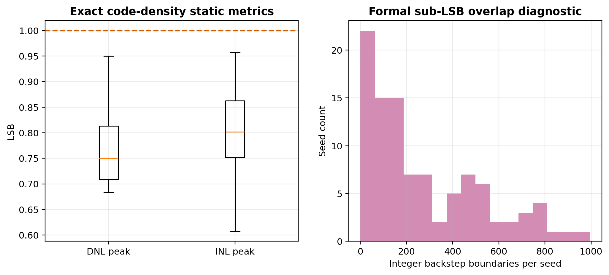

# 12-bit Calibrated Asynchronous SAR ADC — Behavioral Model

[](https://github.com/defineiocc02/Behavioral-modeling-of-12bit-calibrated-sar-adc/releases)
[](LICENSE)
[](https://www.python.org/)
[](docs/MODELING_GUIDE.md)
[](https://ieeexplore.ieee.org/document/8353170)

Fully-differential, asynchronous split-CDAC SAR ADC behavioral model with
charge-conservation solving, P/N-side independent capacitor mismatch, and
foreground weight calibration.  This is the **only active Python behavioral
version** of the project.  Archived Verilog-A, RTL, and earlier Python
experiments are excluded from the active directory.

> Evidence level: **Python behavioral L2.**  Results are not transistor-level
> PVT, post-layout, or silicon measurements.


---

## Locked v3.x CDAC Topology

Per-side integer unit capacitors only.  Identical for v3.0.0 and v3.1.0.

```text
  High segment:  32, 16, 8, 8, 4, 2, 1 Cu   = 71 Cu
  Bridge:                                   2 Cu
  Low segment:   32, 16, 8, 4, 2, 2, 1 Cu  = 65 Cu
  Total per side:                          138 Cu  (552 fF @ Cu=4 fF)
```

Nominal effective weights behind the bridge ($H = 67$):

```text
2144, 1072, 536, 536, 268, 134, 67,
  64,   32,  16,   8,   4,   4,  2, 1 terminal
```

- All 14 high/low capacitors sample the input during normal conversion.
- 15 comparator decisions: 14 physical trial/compare/commit + 1 terminal.
- High-segment 8-Cu duplicate provides wide-range redundancy.
- Decoder is a plain P/N calibrated weighted sum with Q2 rounding — **no
  LUT, DP, exception tables, or stateful monotonic clamps**.


---

## Calibration

Foreground force-0/force-1 half-difference protocol (Shen 2018 JSSC).

The complete low segment (131 Q0) serves as the seed ruler and is **not
self-calibrated** — the main comparator's ~3 mV offset cannot reliably cover
the lowest several bits' backend margin.

```
Calibration order:  H1 → H2 → H4 → H8-R → H8-A → H16 → H32
Pairs per target:   128                    (v3.1, down from 512)
Total sub-convs:    7 × 4 × 128 = 3584    (v3.1, down from 14336)
Dither:             OFF (noise ≧ 1 LSB makes it redundant)
```

Each target runs P0/P1/N0/N1 four lower-SAR sub-conversions with
half-difference averaging to extract per-side weights.

| Parameter | v3.0.0 | v3.1.0 | Rationale |
|-----------|--------|--------|-----------|
| `AVG_PAIRS` | 512 | **128** | Oracle gap saturated by 128; 4× faster |
| `SHEN_DITHER_LSB` | ON (hardcoded) | **OFF** (config) | Noise ≧ 1 LSB provides natural dithering |
| Divider | — | **right-shift 7** | 128=2⁷, no hardware divider needed |


---

## v3.1.0 Results

100-seed Monte Carlo, TSMC 180nm conservative estimate (`σ = 1%` unit-cap
mismatch), 128 pairs, 1 mV RMS calibration noise, rectangular-window
coherent FFT.

| Metric | Pre-Cal | Post-Cal Q2 | Physical Oracle |
|--------|--------:|------------:|----------------:|
| SNDR P50 | 63.73 dB | **74.50 dB** | 74.64 dB |
| ENOB P50 | 10.29 bit | **12.08 bit** | 12.11 bit |
| SFDR P50 | 70.57 dB | 94.29 dB | 96.91 dB |

- **100/100 seeds calibrated, 0/100 negative gain**
- Oracle gap P50: **0.14 dB** (v3.0 was 0.16 dB at σ=0.5%)
- DNL peak P95: 0.75 LSB; INL peak P95: 0.80 LSB
- 100/100 zero missing codes, max jump = 1
- Integer-12 diagnostic: 71.15 dB / 11.53 bit — proves loss is from
  re-quantization, not calibration quality

| σ (MC_SIGMA) | Pre-SNDR | Post-SNDR | Oracle Gap | Verdict |
|:--------:|--------:|--------:|----------:|:--------:|
| 1% | 63.7 dB | 74.5 dB | 0.14 dB | Pass |
| 2% | 50.1 dB | 73.3 dB | 1.34 dB | Pass |
| 5% | 42.2 dB | 72.6 dB | 2.05 dB | Pass |
| 10% | 36.1 dB | 70.2 dB | 4.47 dB | Marginal |
| 20% | 30.2 dB | 50.6 dB | 24.0 dB | Fail |

Full evidence: [v3.0 release](docs/RELEASE_RESULTS_V3.md),
[analysis suite](src/python_cal/analysis/).

---

## FFT Protocol

| Parameter | Value |
|-----------|------:|
| FFT points | 4096 |
| Coherent bin | 127 |
| Phase | 0.123 rad |
| Input amplitude | -0.5 dBFS |
| VFS | per-seed dynamic measurement |
| Window | **Rectangular** |
| Clipping | explicit per-run check |

Coherent sampling places the signal exactly on bin 127 (gcd(127,4096)=1).
No fractional-cycle leakage — rectangular window is both sufficient and
correct (ENBW=1 bin).  Blackman would spread the main lobe across 3-5 bins.

---

## Quick Start

```powershell
# Install
python -m pip install -e ".[dev]"

# Run tests
$env:PYTHONPATH = "src"
python -m pytest src/python_cal/tests -q

# One-click calibration debug (recommended)
python src/python_cal/debug_entry.py
python src/python_cal/debug_entry.py --pairs 64 --mc 0.02
python src/python_cal/debug_entry.py --noise 0.5 --pairs 32
python src/python_cal/debug_entry.py --help

# Full pipeline (100 seeds)
python src/python_cal/run_final_calibration_pipeline.py

# Experiment suite
python src/python_cal/analysis/generate_fft_comparison.py
python src/python_cal/analysis/generate_multisigma_fft.py
```

---

## Hardware Complexity

| Block | Gates / Transistors | Area |
|-------|:------------------:|-----:|
| CDAC capacitor array (30 caps) | passive | ~600 μm² |
| Bottom-plate switches (28×4:1 MUX) | ~560 Tr | ~600 μm² |
| StrongArm comparator | ~24 Tr | ~200 μm² |
| SAR FSM | ~400 gates | ~1200 μm² |
| Calibration controller | ~1800 gates | ~4000 μm² |
| Weighted-sum decoder | ~2000 gates | ~4500 μm² |
| **Total (chip)** | **~4200 gates + ~600 Tr** | **~0.011 mm²** |

See [DELIVERY.md](src/python_cal/DELIVERY.md) for the full hardware
mapping and analysis.

---

## Static Signoff: Two Views

1. **Code-density (paper/silicon standard):** sum input intervals per output
   code → missing codes, DNL, INL, max jump.
2. **Formal reachable-codebook audit:** check every adjacent reachable
   interval for local non-monotonicity.

Non-binary redundancy allows multiple input representations per output code.
Narrower-than-1-LSB local overlap is not a missing code and should not
be hidden.  v3.x release gate: **zero missing codes + max jump ≤ 1 +
DNL/INL ≤ 1 LSB.**



---

## Why Not the Old 95-Cu CDAC?

```text
Old:  1,2,4,6,10,16,24 Cu (low) | 1 Cu (bridge) | 1,2,4,8,16 Cu (high)
New:  integer 138 Cu (above)
```

Under the same 0.5% mismatch and 1000-seed codebook audit:
- Old: missing codes P50=22, worst=84; max jump worst=9
- New: **1000/1000 zero missing codes, max jump always 1**

The extra 43 Cu (138 vs 95) eliminates the need for correction LUTs and
complex decoders.


---

## Directory

```text
src/python_cal/
  config.py              single-source configuration
  debug_entry.py         one-click calibration debug
  DELIVERY.md            handover document for next expert
  topology/              integer CDAC and explicit switch states
  physical/              charge-conservation solver
  comparator/            dynamic comparator model (noise/offset/metastability)
  async_control/         asynchronous SAR handshake
  calibration/           Shen 2018 force-0/force-1 calibration (active only)
  decode/                plain weighted-sum decoder
  validation/            FFT and reachable-codebook audits
  analysis/              experiment scripts and figures
  tests/                 regression suite
docs/
  MODELING_GUIDE.md
  VALIDATION_STATUS.md
  RELEASE_RESULTS_V3.md
  FIGURE_CATALOG.md
  ARCHIVE_POLICY.md
```

Further reading: [Modeling Guide](docs/MODELING_GUIDE.md),
[Validation Status](docs/VALIDATION_STATUS.md),
[Figure Catalog](docs/FIGURE_CATALOG.md).

---

## Citation

If you use this model in your work:

```bibtex
@misc{sar12_cal_behavioral_2026,
  author       = {{SAR ADC Calibration Project Contributors}},
  title        = {12-bit Calibrated Asynchronous SAR ADC -- Behavioral Model},
  year         = {2026},
  version      = {3.1.0},
  url          = {https://github.com/defineiocc02/Behavioral-modeling-of-12bit-calibrated-sar-adc},
  note         = {Python behavioral model, evidence level L2}
}
```

Calibration protocol based on:
> Shen, J. et al., "A 12-bit 10-MS/s SAR ADC with Foreground Calibration,"
> *IEEE JSSC*, vol. 53, no. 7, pp. 1895-1906, 2018.

## License

[MIT](LICENSE)
