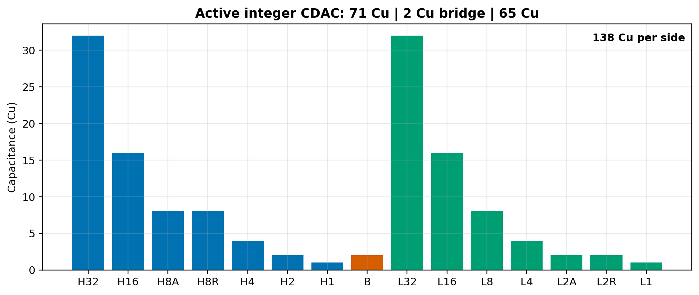
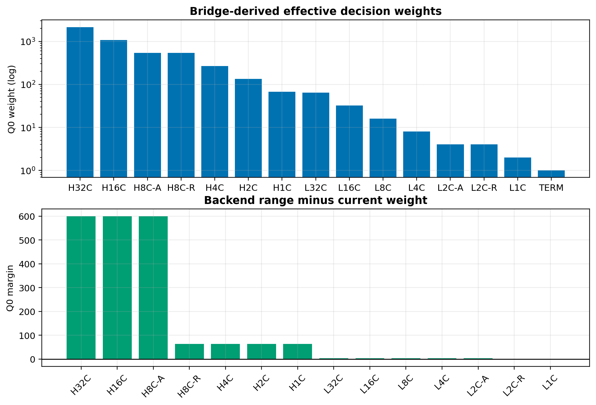
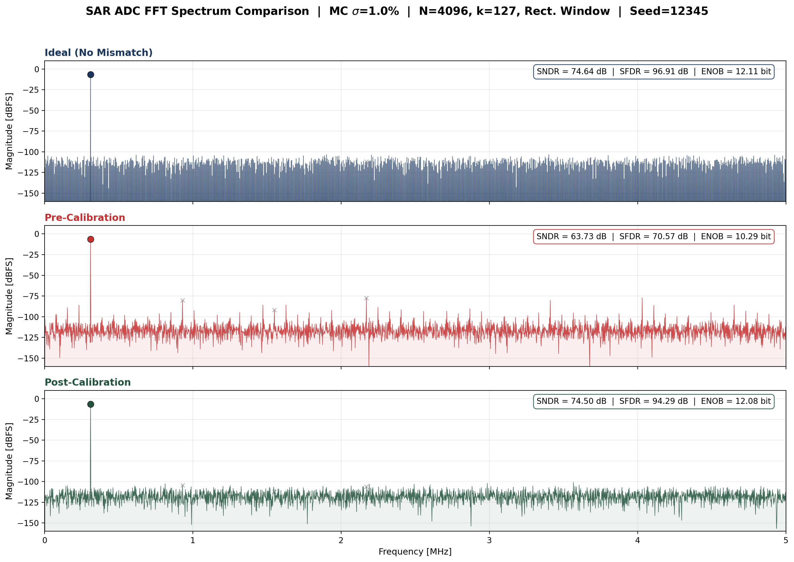
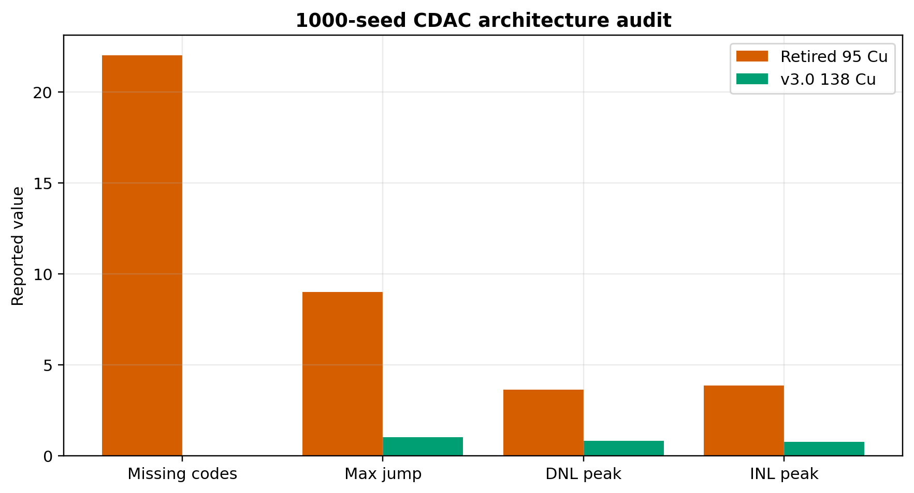

# 12-bit Calibrated Asynchronous SAR ADC — Behavioral Model<br><small>12位校准型异步SAR ADC — 行为级模型</small>

[](https://github.com/defineiocc02/Behavioral-modeling-of-12bit-calibrated-sar-adc/releases)
[](LICENSE)
[](https://www.python.org/)
[](docs/MODELING_GUIDE.md)
[](https://ieeexplore.ieee.org/document/8353170)

**[English](#english) | [中文](#chinese)**

---

<a id="english"></a>

## English

Fully-differential, asynchronous split-CDAC SAR ADC behavioral model with
charge-conservation solving, P/N-side independent capacitor mismatch, and
foreground weight calibration.  This is the **only active Python behavioral
version** of the project.

> Evidence level: **Python behavioral L2.**  Results are not transistor-level
> PVT, post-layout, or silicon measurements.


### Locked v3.x CDAC Topology

Per-side integer unit capacitors only.  Identical for v3.0.0 and v3.1.0.

```text
  High segment:  32, 16, 8, 8, 4, 2, 1 Cu   = 71 Cu
  Bridge:                                   2 Cu
  Low segment:   32, 16, 8, 4, 2, 2, 1 Cu  = 65 Cu
  Total per side:                          138 Cu  (552 fF @ Cu=4 fF)
```

Nominal effective weights ($H = 67$):

```text
2144, 1072, 536, 536, 268, 134, 67,
  64,   32,  16,   8,   4,   4,  2, 1 terminal
```

- All 14 high/low capacitors sample the input — no VCM-masked caps.
- 15 comparator decisions: 14 physical trial/compare/commit + 1 terminal.
- High-segment 8-Cu duplicate provides wide-range redundancy.
- Decoder: **plain P/N calibrated weighted sum with Q2 rounding.**
  No LUT, DP, exception tables, or stateful monotonic clamps.



### Calibration

Foreground force-0/force-1 half-difference protocol (Shen 2018 JSSC).

The complete low segment (131 Q0) serves as the seed ruler and is **not
self-calibrated** — the main comparator's ~3 mV offset cannot reliably cover
the lowest bits' backend margin.

```
Calibration order:  H1 → H2 → H4 → H8-R → H8-A → H16 → H32
Pairs per target:   128                    (v3.1, down from 512)
Total sub-convs:    7 × 4 × 128 = 3584    (v3.1, down from 14336)
Dither:             OFF (noise ≧ 1 LSB makes it redundant)
```

| Parameter | v3.0.0 | v3.1.0 | Rationale |
|-----------|--------|--------|-----------|
| `AVG_PAIRS` | 512 | **128** | Oracle gap saturated by 128; 4× faster |
| `SHEN_DITHER_LSB` | ON (hardcoded) | **OFF** (config) | Redundant when noise ≧ 1 LSB + N ≧ 32 |
| Divider | — | **right-shift 7** | 128=2⁷, no hardware divider needed |



### v3.1.0 Results

100-seed Monte Carlo, TSMC 180nm conservative (`σ = 1%` unit-cap mismatch),
128 pairs, 1 mV RMS calibration noise, rectangular-window coherent FFT.

| Metric | Pre-Cal | Post-Cal Q2 | Physical Oracle |
|--------|--------:|------------:|----------------:|
| SNDR P50 | 63.73 dB | **74.50 dB** | 74.64 dB |
| ENOB P50 | 10.29 bit | **12.08 bit** | 12.11 bit |
| SFDR P50 | 70.57 dB | 94.29 dB | 96.91 dB |

- 100/100 seeds calibrated, 0/100 negative gain
- Oracle gap P50: **0.14 dB**
- DNL peak P95: 0.75 LSB; INL peak P95: 0.80 LSB
- 100/100 zero missing codes, max jump = 1

| σ (MC_SIGMA) | Pre-SNDR | Post-SNDR | Oracle Gap | Verdict |
|:------------:|--------:|--------:|----------:|:--------:|
| 1% | 63.7 dB | 74.5 dB | 0.14 dB | Pass |
| 2% | 50.1 dB | 73.3 dB | 1.34 dB | Pass |
| 5% | 42.2 dB | 72.6 dB | 2.05 dB | Pass |
| 10% | 36.1 dB | 70.2 dB | 4.47 dB | Marginal |
| 20% | 30.2 dB | 50.6 dB | 24.0 dB | Fail |

More: [v3.0 release notes](docs/RELEASE_RESULTS_V3.md),
[analysis suite](src/python_cal/analysis/).



### FFT Protocol

| Parameter | Value |
|-----------|------:|
| FFT points | 4096 |
| Coherent bin | 127 |
| Phase | 0.123 rad |
| Input amplitude | -0.5 dBFS |
| VFS | per-seed dynamic measurement |
| Window | **Rectangular** |
| Clipping | explicit per-run check |

Coherent sampling: signal on bin 127 (gcd(127,4096)=1).  No leakage —
rectangular window is correct (ENBW=1 bin).

### Quick Start

```powershell
# Install
python -m pip install -e ".[dev]"

# Run tests
$env:PYTHONPATH = "src"
python -m pytest src/python_cal/tests -q

# One-click calibration debug ★
python src/python_cal/debug_entry.py
python src/python_cal/debug_entry.py --pairs 64 --mc 0.02
python src/python_cal/debug_entry.py --noise 0.5 --pairs 32

# Full pipeline (100 seeds)
python src/python_cal/run_final_calibration_pipeline.py

# Experiment suite
python src/python_cal/analysis/generate_fft_comparison.py
python src/python_cal/analysis/generate_multisigma_fft.py
```

### Hardware Complexity

| Block | Gates / Tr. | Area |
|-------|:----------:|-----:|
| CDAC capacitor array (30 caps) | passive | ~600 μm² |
| Bottom-plate switches (28×4:1 MUX) | ~560 Tr | ~600 μm² |
| StrongArm comparator | ~24 Tr | ~200 μm² |
| SAR FSM | ~400 gates | ~1200 μm² |
| Calibration controller | ~1800 gates | ~4000 μm² |
| Weighted-sum decoder | ~2000 gates | ~4500 μm² |
| **Total** | **~4200 gates + ~600 Tr** | **~0.011 mm²** |

Full analysis: [DELIVERY.md](src/python_cal/DELIVERY.md)

### Why Not the Old 95-Cu CDAC?

```text
Old:  1,2,4,6,10,16,24 Cu (low) | 1 Cu (bridge) | 1,2,4,8,16 Cu (high)
New:  integer 138 Cu
```

Same 0.5% mismatch, 1000-seed codebook audit:
- Old: missing codes P50=22, worst=84; max jump worst=9
- New: **1000/1000 zero missing codes, max jump always 1**



### Directory

```text
src/python_cal/
  config.py              single-source configuration
  debug_entry.py         one-click calibration debug ★
  DELIVERY.md            handover document
  topology/              integer CDAC and explicit switch states
  physical/              charge-conservation solver
  comparator/            dynamic comparator model
  async_control/         asynchronous SAR handshake
  calibration/           Shen 2018 force-0/force-1 calibration
  decode/                plain weighted-sum decoder
  validation/            FFT and reachable-codebook audits
  analysis/              experiment scripts + figures
  tests/                 regression suite
docs/
  MODELING_GUIDE.md, VALIDATION_STATUS.md, RELEASE_RESULTS_V3.md, ...
```

### Citation

```bibtex
@misc{sar12_cal_behavioral_2026,
  author       = {{SAR ADC Calibration Project Contributors}},
  title        = {12-bit Calibrated Asynchronous SAR ADC -- Behavioral Model},
  year         = {2026},
  version      = {3.1.0},
  url          = {https://github.com/defineiocc02/Behavioral-modeling-of-12bit-calibrated-sar-adc},
  note         = {Python behavioral model, evidence level L2}
}
```

Calibration protocol: Shen et al., "A 12-bit 10-MS/s SAR ADC with
Foreground Calibration," *IEEE JSSC*, vol. 53, no. 7, pp. 1895-1906, 2018.

### License

[MIT](LICENSE)

---

<a id="chinese"></a>

## 中文

全差分、异步 split-CDAC SAR ADC 行为级模型。包含电荷守恒求解、
P/N 分侧独立电容失配、前景权重校准。本项目**唯一有效的 Python 行为级版本**。

> 证据等级: **Python behavioral L2.** 非晶体管级 PVT、非版图后仿、非硅片测量。


### 锁定 v3.x CDAC 拓扑

每侧仅使用整数单位电容。v3.0.0 与 v3.1.0 完全相同。

```text
  高段:   32, 16, 8, 8, 4, 2, 1 Cu   = 71 Cu
  桥接:                             2 Cu
  低段:   32, 16, 8, 4, 2, 2, 1 Cu  = 65 Cu
  单侧总计:                          138 Cu  (552 fF @ Cu=4 fF)
```

标称有效权重 ($H = 67$):

```text
2144, 1072, 536, 536, 268, 134, 67,
  64,   32,  16,   8,   4,   4,  2, 1 终端位
```

- 全部 14 个高/低段电容参与采样输入——无屏蔽电容。
- 15 次比较器判决: 14 物理 trial/compare/commit + 1 终端位。
- 高段 8-Cu 冗余提供大范围容错。
- 解码器: **纯 P/N 校准权重加权和 + Q2 舍入。**
  无 LUT、无 DP、无异常表、无状态钳位。


### 校准

前景 force-0/force-1 半差法 (Shen 2018 JSSC)。

完整低段 (131 Q0) 作为匹配基准尺，**不自校准**——主比较器 ~3 mV offset
无法可靠覆盖最低几位的后端 margin。

```
校准顺序:  H1 → H2 → H4 → H8-R → H8-A → H16 → H32
每目标对数: 128                     (v3.1, 从 512 降低)
总子转换:   7 × 4 × 128 = 3584     (v3.1, 从 14336 降低)
Dither:    关闭 (噪声 ≧ 1 LSB 即冗余)
```

| 参数 | v3.0.0 | v3.1.0 | 理由 |
|------|--------|--------|------|
| `AVG_PAIRS` | 512 | **128** | Oracle gap 在 128 对后饱和; 快 4 倍 |
| `SHEN_DITHER_LSB` | 开 (硬编码) | **关** (config) | 噪声 ≧ 1 LSB + N ≧ 32 时冗余 |
| 除法器 | — | **右移 7 位** | 128=2⁷, 无需硬件除法器 |


### v3.1.0 结果

100-seed Monte Carlo, TSMC 180nm 保守估计 (`σ = 1%` 单位电容失配),
128 对, 1 mV RMS 校准噪声, 矩形窗相干 FFT。

| 指标 | 校准前 | 校准后 Q2 | Physical Oracle |
|------|--------:|----------:|----------------:|
| SNDR P50 | 63.73 dB | **74.50 dB** | 74.64 dB |
| ENOB P50 | 10.29 bit | **12.08 bit** | 12.11 bit |
| SFDR P50 | 70.57 dB | 94.29 dB | 96.91 dB |

- 100/100 有效校准, 0/100 负收益
- Oracle gap P50: **0.14 dB**
- DNL peak P95: 0.75 LSB; INL peak P95: 0.80 LSB
- 100/100 零缺码, 最大跳码 = 1

| σ (MC_SIGMA) | 校准前 | 校准后 | Oracle Gap | 判定 |
|:------------:|--------:|--------:|----------:|:----:|
| 1% | 63.7 dB | 74.5 dB | 0.14 dB | 通过 |
| 2% | 50.1 dB | 73.3 dB | 1.34 dB | 通过 |
| 5% | 42.2 dB | 72.6 dB | 2.05 dB | 通过 |
| 10% | 36.1 dB | 70.2 dB | 4.47 dB | 临界 |
| 20% | 30.2 dB | 50.6 dB | 24.0 dB | 失败 |

更多: [v3.0 发布说明](docs/RELEASE_RESULTS_V3.md),
[实验套件](src/python_cal/analysis/).


### FFT 协议

| 参数 | 值 |
|------|------:|
| FFT 点数 | 4096 |
| 相干 bin | 127 |
| 相位 | 0.123 rad |
| 输入幅度 | -0.5 dBFS |
| VFS | 每 seed 动态测量 |
| 窗函数 | **矩形窗 (无窗)** |
| clipping | 每次运行显式检查 |

相干采样: 信号精确落在 bin 127 (gcd(127,4096)=1)。无泄漏——矩形窗是正确的 (ENBW=1 bin)。

### 快速开始

```powershell
# 安装
python -m pip install -e ".[dev]"

# 运行测试
$env:PYTHONPATH = "src"
python -m pytest src/python_cal/tests -q

# 一键校准调试 ★
python src/python_cal/debug_entry.py
python src/python_cal/debug_entry.py --pairs 64 --mc 0.02
python src/python_cal/debug_entry.py --noise 0.5 --pairs 32

# 完整管线 (100 seeds)
python src/python_cal/run_final_calibration_pipeline.py

# 实验套件
python src/python_cal/analysis/generate_fft_comparison.py
python src/python_cal/analysis/generate_multisigma_fft.py
```

### 硬件复杂度

| 模块 | 门数/晶体管 | 面积 |
|------|:----------:|-----:|
| CDAC 电容阵列 (30个) | 被动器件 | ~600 μm² |
| 底板开关 (28×4:1 MUX) | ~560 Tr | ~600 μm² |
| StrongArm 比较器 | ~24 Tr | ~200 μm² |
| SAR FSM | ~400 门 | ~1200 μm² |
| 校准控制器 | ~1800 门 | ~4000 μm² |
| 加权和解码器 | ~2000 门 | ~4500 μm² |
| **总计** | **~4200 门 + ~600 Tr** | **~0.011 mm²** |

完整分析: [DELIVERY.md](src/python_cal/DELIVERY.md)

### 为何不用旧 95-Cu CDAC ?

```text
旧:  1,2,4,6,10,16,24 Cu (低段) | 1 Cu (桥接) | 1,2,4,8,16 Cu (高段)
新:  整数 138 Cu
```

同 0.5% 失配, 1000-seed 码本审计:
- 旧: 缺码 P50=22, 最坏=84; 最大跳码最坏=9
- 新: **1000/1000 零缺码, 最大跳码始终=1**


### 目录结构

```text
src/python_cal/
  config.py              统一配置入口
  debug_entry.py         一键校准调试 ★
  DELIVERY.md            递交文档
  topology/              整数 CDAC 拓扑与开关状态
  physical/              电荷守恒求解器
  comparator/            动态比较器模型
  async_control/         异步 SAR 握手
  calibration/           Shen 2018 force-0/force-1 校准
  decode/                纯加权和解码器
  validation/            FFT 与可达码本审计
  analysis/              实验脚本与图表
  tests/                 回归测试套件
docs/
  MODELING_GUIDE.md, VALIDATION_STATUS.md, RELEASE_RESULTS_V3.md, ...
```

### 引用

```bibtex
@misc{sar12_cal_behavioral_2026,
  author       = {{SAR ADC Calibration Project Contributors}},
  title        = {12-bit Calibrated Asynchronous SAR ADC -- Behavioral Model},
  year         = {2026},
  version      = {3.1.0},
  url          = {https://github.com/defineiocc02/Behavioral-modeling-of-12bit-calibrated-sar-adc},
  note         = {Python behavioral model, evidence level L2}
}
```

校准协议基于: Shen et al., "A 12-bit 10-MS/s SAR ADC with Foreground
Calibration," *IEEE JSSC*, vol. 53, no. 7, pp. 1895-1906, 2018.

### 开源许可

[MIT](LICENSE)
