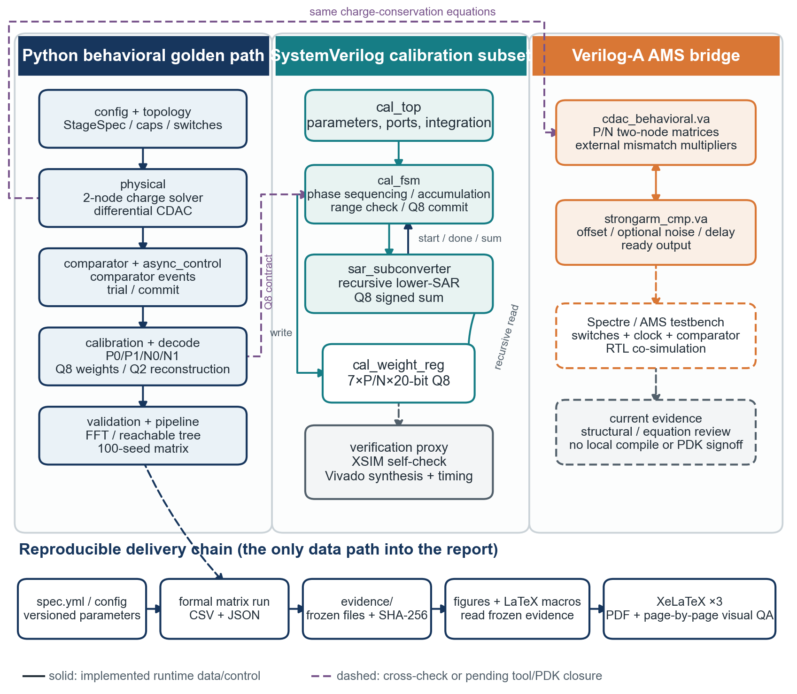
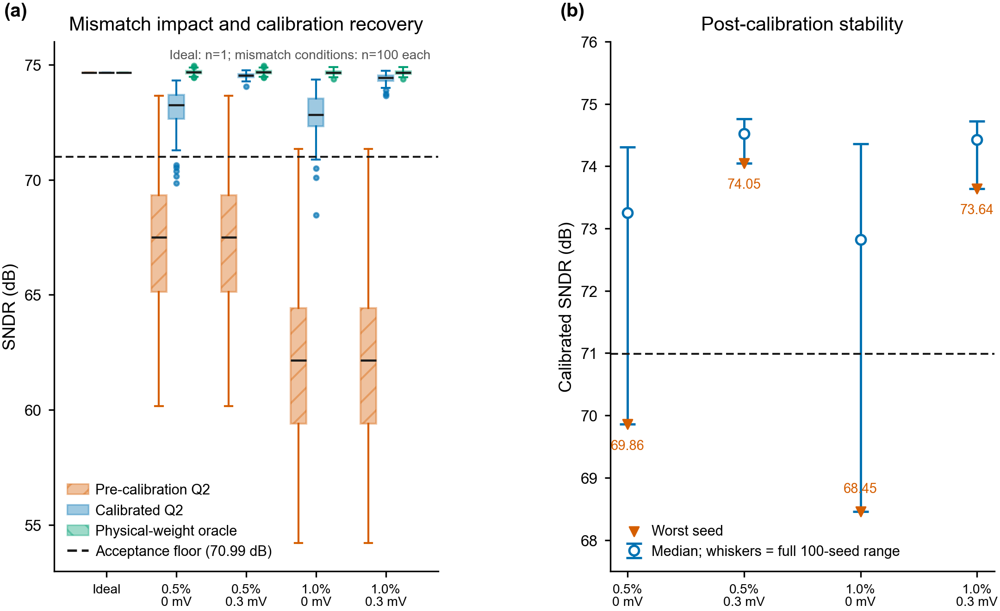
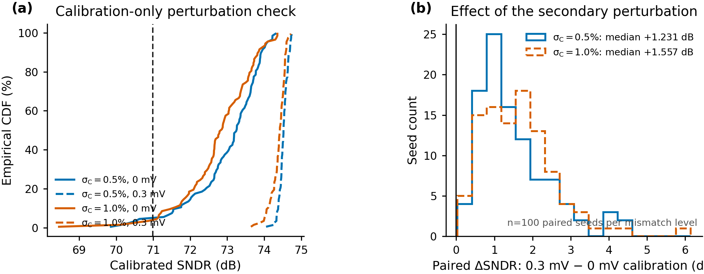
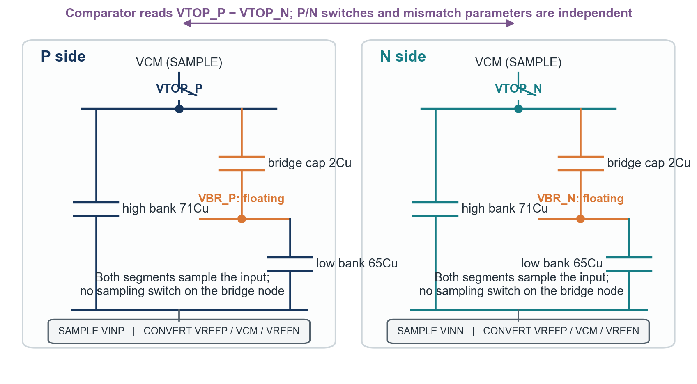
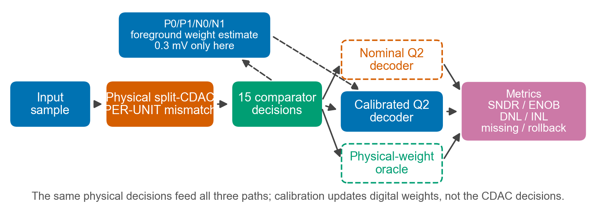
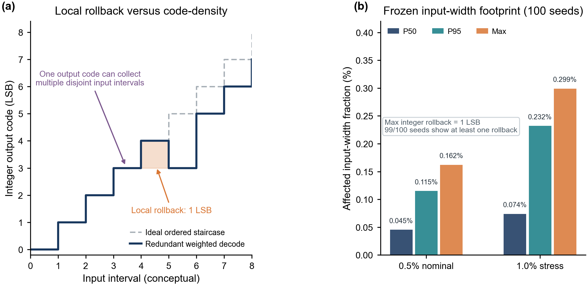
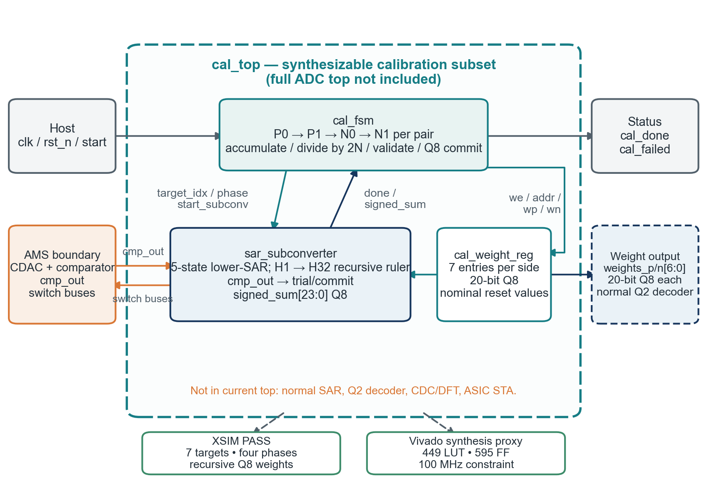

# 12-bit Mismatch-Calibrated SAR ADC

> 12 位全差分 split-CDAC SAR ADC：从物理单位电容失配、前景权重校准，
> 到 Python 行为模型、可综合校准 RTL 与 Verilog-A 接口的可复现工程。

[](VERSION)
[](https://github.com/defineiocc02/Behavioral-modeling-of-12bit-calibrated-sar-adc/actions/workflows/python-model.yml)
[](https://www.python.org/)
[](docs/VALIDATION_STATUS.md)
[](LICENSE)

本项目只回答一个主问题：**电容失配会怎样影响 SAR ADC，以及前景数字权重
校准能否把整体性能稳住？** 噪声不是主线。正式 nominal 场景采用独立
**PER-UNIT** 失配；`0.3 mV RMS` 只注入前景校准比较过程，用来解除 lower-SAR
确定性量化锁定，正常转换、FFT 和 SNDR 路径保持零噪声。

> **证据边界**：当前结论是经过 100-seed Monte Carlo、静态可达码审计、
> Python 回归、XSIM 和 Vivado synthesis proxy 支持的行为级/数字工程证据；
> 不是晶体管级 PVT、版图后仿或硅片 signoff。

<p align="center">
  
</p>

## 项目先看结论

| 读者最关心的问题 | 当前答案 |
|---|---|
| 理想 ADC 链路正确吗？ | **正确**：SNDR `74.643 dB`，ENOB `12.107 bit`，0 missing code，0 backstep |
| 0.5% 单位电容失配能稳住吗？ | **能**：0.3 mV calibration-only 条件下，动态/静态/综合判定均为 `100/100` |
| 1.0% 双倍压力点怎样？ | 动态 `100/100`；静态 `98/100`，如实保留两个 INL 尾部失败样本 |
| 校准是否修改模拟 CDAC？ | **否**：物理 decisions 只运行一次；校准只更新 P/N 分侧数字权重 |
| 失配后的局部回退是否致命？ | nominal 最大 rollback 为 `1 LSB`，最大受影响输入宽度 `0.1620%`；作为诊断记录，不额外堆 LUT/CAM/clamp |
| RTL 可以综合和跑测试吗？ | **可以**：两组 XSIM 自检通过，综合为 `449 LUT + 595 FF` |
| 已经可以流片了吗？ | **不可以这样宣称**：setup proxy 通过，但 hold 尚有 4 个失败端点；PDK/PVT/PEX/晶体管级证据仍缺失 |

快速入口：
[最终 PDF 报告](docs/final_report.pdf) ·
[验证状态](docs/VALIDATION_STATUS.md) ·
[工程架构](docs/ENGINEERING_ARCHITECTURE.md) ·
[建模说明](docs/MODELING_GUIDE.md) ·
[版本管理](docs/VERSION_MANAGEMENT.md) ·
[冻结证据](evidence/mismatch_matrix/)

## 失配到底造成了什么

正式失配模型不是给每个整组电容平铺同一个相对误差的 PER-CAP，而是先对
每个单位电容独立抽样，再求和形成物理 capacitor group：

```text
Cunit,i = Cu × (1 + εi),       εi ~ Normal(0, σunit²)
Cgroup  = Σ Cunit,i
```

因此，一个由 `N` 个单位电容组成的 group，其相对 sigma 自然约为
`σunit/√N`。P/N 两侧独立抽样，2-Cu bridge 的两个 units 也独立。

<p align="center">
  
</p>

### 冻结验证矩阵

| 场景 | Pre SNDR P50 | Cal SNDR P50 / min | 动态 | 静态 | 缺码 | 定位 |
|---|---:|---:|---:|---:|---:|---|
| ideal, 0 mV | 74.643 | 74.643 / 74.643 dB | 1/1 | 1/1 | 0 | 理想基线 PASS |
| 0.5% PER-UNIT, 0 mV | 67.506 | 73.249 / 69.857 dB | 95/100 | 40/100 | 1 | 量化锁定隔离组 |
| **0.5% PER-UNIT, 0.3 mV** | 67.506 | **74.521 / 74.050 dB** | **100/100** | **100/100** | **0** | **nominal PASS** |
| 1.0% PER-UNIT, 0 mV | 62.154 | 72.825 / 68.455 dB | 96/100 | 27/100 | 1 | 压力隔离组 |
| 1.0% PER-UNIT, 0.3 mV | 62.154 | 74.424 / 73.641 dB | 100/100 | 98/100 | 0 | stress 尾部 FAIL |

所有失配组使用同一批 100 个 seeds。动态、静态和综合判定逐 seed 保存于
[`evidence/mismatch_matrix/`](evidence/mismatch_matrix/)，不是只展示均值或
挑选最好样本。名义场景 calibrated decoder 相对 physical-weight oracle 的
SNDR gap P50/P95 仅为 `0.135/0.357 dB`。

### `0.3 mV` 不是 ADC 输入噪声指标

它的唯一定义是校准 P0/P1/N0/N1 比较时的输入等效高斯扰动：

```text
ncal ~ Normal(0, (0.3 mV RMS)²)
normal conversion noise = 0
```

零扰动隔离组暴露了重复 lower-SAR 测量的确定性量化锁定；0.3 mV 场景检查
在小扰动下平均权重能否稳定收敛。项目没有额外 dither DAC，也没有把该扰动
注入正常转换来虚构 SNDR 改善。

<p align="center">
  
</p>

## CDAC、采样与比较决策

每个差分侧均采用整数单位电容：

```text
high segment : 32, 16, 8, 8, 4, 2, 1 Cu  = 71 Cu
bridge       : 2 Cu
low segment  : 32, 16, 8, 4, 2, 2, 1 Cu  = 65 Cu
total        :                                138 Cu / side
```

<p align="center">
  
</p>

关键物理约束：

- P/N 两侧各有 14 个 physical bottom-plate groups；
- 正常采样时全部 high/low 电容参与输入采样；
- 只有 `VTOP_P/VTOP_N` 在采样相位钳到 VCM；
- bridge node 是内部浮动节点，不增加 bridge-node sampling switch；
- 每次转换包含 14 个物理 trial/compare/commit，以及一个不增加电容的
  comparator-only terminal decision；
- decoder 是普通 P/N 加权和，不包含 decision LUT、CAM、异常映射或单调钳位。

Python 与 Verilog-A 使用同一套两节点电荷守恒矩阵求解 top/bridge 电压，
避免把 bridge 简化成固定比例后再补经验权重。

## 前景校准与公平验证协议

七个 high-segment 目标按以下顺序递归校准：

```text
H1 → H2 → H4 → H8-R → H8-A → H16 → H32
```

对每个目标执行 P0/P1/N0/N1 四相测量：

```text
WP = mean(SP0 - SP1) / 2
WN = mean(SN1 - SN0) / 2
```

默认 128 pairs，共 `7 × 4 × 128 = 3584` 次 lower-SAR sub-conversions。
每个目标完成后立即截断到 Q8，与 `cal_weight_reg.sv` 的寄存器和算术右移
一致；最终 ADC 输出使用 Q2 加权和。

<p align="center">
  
</p>

公平性要求是：每个 seed 只执行一次物理 conversion，并保存同一组 15-bit
comparator decisions；nominal、calibrated 和 physical-weight oracle 三路 decoder
随后读取完全相同的 decisions。校准不会回头修改已经发生的 CDAC 比较结果。

FFT 固定为 4096 点、coherent bin 1019、phase `0.123 rad`、`-0.5 dBFS`、
rectangular window；每个 seed 都重新测量可用 VFS 并检查 clipping。

## 单调性：记录问题，但不为诊断指标堆硬件

<p align="center">
  
</p>

理想链路为 0 backstep。失配后，冗余 decision words 的相邻可达区间可能发生
局部次序交换；nominal 场景 99/100 seeds 能观察到这种诊断现象，但：

- 最大 rollback 始终只有 `1 LSB`；
- nominal 最大受影响输入宽度为 `0.1620%`；
- nominal dynamic、missing-code、DNL/INL 与综合验收仍为 `100/100`。

因此当前版本保留 backstep count、rollback 和区间宽度数据，却不为了把诊断
数字归零而增加 LUT、排序器、CAM 或有状态 clamp。若未来应用明确要求
strict monotonicity，再把它升级成独立硬规格；目前不会把“数学上每个可达边界
严格有序”偷换成“ADC 整体性能是否满足要求”。

## Python、RTL 与 Verilog-A 如何组织

```text
src/python_cal/
  topology/          StageSpec、单位电容与开关状态
  physical/          差分两节点电荷守恒求解器
  comparator/        comparator event/offset 行为
  async_control/     15 次异步 trial/commit 控制
  calibration/       P0/P1/N0/N1 前景递归权重校准
  decode/            nominal/calibrated/oracle Q2 重构
  validation/        FFT、reachable tree、DNL/INL 与矩阵汇总
  tests/             Python 回归测试

rtl/                 可综合 calibration/lower-SAR 子集与 XSIM testbench
va/                  split-CDAC 与 StrongArm comparator 行为接口
evidence/            冻结 CSV/JSON/manifest/SHA-256
scripts/             矩阵、冻结、绘图、综合、时序与复现入口
docs/                工程说明、活动图、LaTeX 源和最终 PDF
```

<p align="center">
  
</p>

| 工程层 | 已完成 | 仍未完成/不能外推 |
|---|---|---|
| Python behavioral | 物理 CDAC、采样、转换、校准、三路 Q2 解码、FFT、静态审计 | 不是 transistor/PVT/silicon 结果 |
| Calibration RTL | `cal_top`、FSM、recursive lower-SAR、7×P/N×20-bit Q8 register；两组 XSIM PASS | 不包含完整 normal SAR、Q2 decoder、CDC/DFT、ASIC STA |
| Vivado proxy | 449 LUT、595 FF、0 DSP/BRAM；100 MHz setup WNS `+0.298 ns` | hold WHS `-0.147 ns`、4 个失败端点；342/125 IOB，raw top 不是可布局封装顶层 |
| Verilog-A | `cdac_behavioral.va` 与 `strongarm_cmp.va` 的方程、端口和结构审查 | 尚无本机 Spectre/OpenVAF 编译、目标 PDK 或 AMS co-simulation |
| Tapeout signoff | 架构和接口已具备继续实现的工程意义 | 尚缺 transistor、reference/switch、PVT、kickback、PEX、功耗和硅片数据 |

## 快速开始

### 1. 安装并运行回归

```powershell
python -m pip install `
  -c requirements\report-render-py313.txt `
  -e ".[dev,docs]"

$env:PYTHONPATH = (Resolve-Path src).Path
python -m pytest
```

当前发布基线为 `73 passed`。

### 2. 从冻结证据重建图表和 PDF

这条路径不会重新运行 4096-point × 100-seed 矩阵，适合审核当前发布：

```powershell
.\scripts\reproduce.ps1 -BuildPdf
```

输出为 [`docs/final_report.pdf`](docs/final_report.pdf)。报告图只读取冻结的
[`evidence/mismatch_matrix/`](evidence/mismatch_matrix/)；PDF/SVG/指标在 CI 中
执行确定性复现门禁，PNG 作为跨平台视觉预览检查尺寸、模式和可解码性。

### 3. 需要时重跑完整五组矩阵

```powershell
.\scripts\run_mismatch_matrix.ps1 -Seeds 100 -AveragePairs 128
python -m python_cal.validation.summarize_mismatch_matrix
python scripts\freeze_mismatch_evidence.py
python scripts\generate_report_figures.py --matrix-root evidence\mismatch_matrix
python scripts\generate_report_metrics.py
.\scripts\reproduce.ps1 -BuildPdf
```

重跑会更新数据；提交前必须核对 manifest、源码哈希、逐 seed 尾部失败和图稿，
不能只用一张平均曲线覆盖异常样本。

## 文档与证据索引

| 文档 | 用途 |
|---|---|
| [最终工程报告](docs/final_report.pdf) | 30 页完整 LaTeX 报告、底层方程、结果、RTL/VA、时序和边界 |
| [验证状态](docs/VALIDATION_STATUS.md) | 五组矩阵、逐 seed yield、静态失败样本与正式 verdict |
| [工程架构](docs/ENGINEERING_ARCHITECTURE.md) | Python/RTL/VA 职责、接口、数据流和实现边界 |
| [建模指南](docs/MODELING_GUIDE.md) | CDAC、采样、decision、Q8/Q2 和验证协议 |
| [硬件与 Verilog-A 移植说明](docs/HARDWARE_AND_VERILOGA_PORT.md) | RTL、AMS 接口与后续集成路径 |
| [本机与 VM 工作区地图](docs/VM_WORKSPACE_MAP.md) | Git/OA/仿真目录、VA版本差异、最后运行状态与安全整理边界 |
| [图稿目录](docs/FIGURE_CATALOG.md) | 当前图、历史图与生成规则 |
| [版本管理](docs/VERSION_MANAGEMENT.md) | 活动、冻结、历史和临时产物边界 |
| [最终交付索引](FINAL_SUBMISSION.md) | 发布入口、复现命令和已知限制 |

## 当前明确不做的过度设计

- 不把 nominal 问题升级成 512-pair 默认校准；
- 不添加 calibration sub-DAC、auxiliary comparator 或额外 dither DAC；
- 不用 decision LUT/CAM/异常表掩盖失配结果；
- 不为局部 1-LSB diagnostic backstep 加有状态 monotonic clamp；
- 不在 bridge node 增加错误的 sampling clamp；
- 不从 FPGA proxy 推算 ASIC 面积、功耗、良率或流片状态；
- 不把 calibration-only 0.3 mV 扰动包装成正常 ADC 噪声性能。

保留 Q2、15th terminal、P/N 分侧 Q8 权重和每目标即时写回，是因为它们有
直接的物理、性能或 RTL 一致性依据，而不是为了堆功能。

## English summary

This repository studies the impact of **independent per-unit capacitor mismatch**
on a 12-bit differential split-CDAC SAR ADC and verifies whether foreground
digital weight calibration keeps the converter within its behavioral targets.
The primary 0.5% unit-mismatch case passes 100/100 dynamic and static seeds after
calibration. The 0.3 mV RMS term is injected during calibration comparisons only;
normal ADC conversions remain noiseless.

The repository contains a charge-conservation Python model, synthesizable
calibration/lower-SAR RTL, Verilog-A CDAC/comparator interfaces, frozen Monte Carlo
evidence, deterministic figures, and a visually reviewed LaTeX report. These are
behavioral and digital implementation results—not transistor-level, post-layout,
or silicon signoff.

## License

[MIT](LICENSE)
