# Figure Catalog

所有图由
[`docs/figures/generate_modeling_figures.py`](figures/generate_modeling_figures.py)
从提交的 JSON/CSV 证据生成。每图同时提供 PNG、SVG 和 PDF；PDF 已检查
字体嵌入且不含 Type 3 字体。

| 图 | 内容 | 数据来源 |
|---|---|---|
| Fig. 1 | Python 模型顶层架构和校准反馈 | 代码结构 |
| Fig. 2 | 14 个 decision weights 与数字 terminal | baseline JSON |
| Fig. 3 | 13 次物理 trial + terminal compare | switching policy |
| Fig. 4 | P/N force、lower-SAR、半差与递归 ruler | Shen calibrator |
| Fig. 5 | 数学理想、物理理想与旧幅度对比 | baseline JSON |
| Fig. 6 | 100-seed SNDR/ENOB 分布 | pipeline CSV |
| Fig. 7 | int12 与 Q2 的第二量化损失 | pipeline CSV |
| Fig. 8 | 七目标绝对/归一化权重误差 | summary JSON |
| Fig. 9 | oracle gap 直方图与 ECDF | pipeline CSV |
| Fig. 10 | full-static 指标与 H4 carry margin | static/carry JSON |
| Fig. 11 | v2.1.0 完成状态矩阵 | validation matrix |

## Fig. 1 — Model architecture

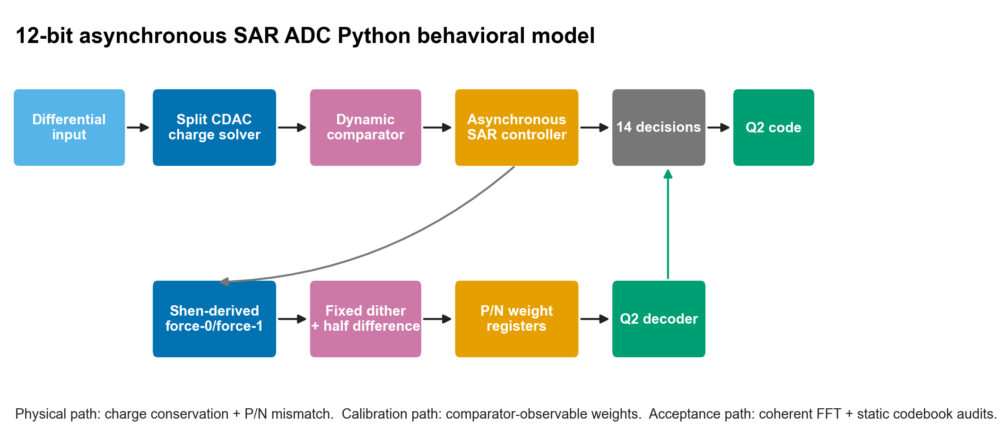

展示物理转换路径、校准路径和 Q2 decoder 的边界。灰色反馈仅表示异步
controller 为校准子转换提供控制，不表示 calibration weights 反馈改变
普通转换 decisions。

## Fig. 2 — Decision weights

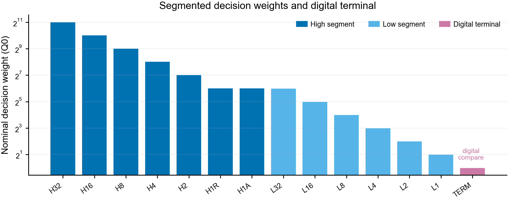

对数坐标显示高段、低段和 terminal 的 Q0 权重。TERM 的 1 Q0 是数字残差
判决，不是 0.5Cu 电容。

## Fig. 3 — Asynchronous sequence

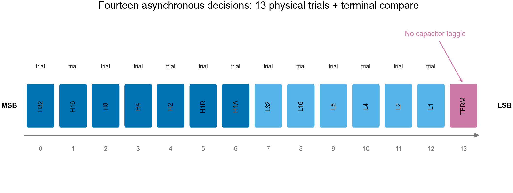

stages 0–12 切换真实电容；stage 13 只比较当前残差。

## Fig. 4 — Calibration flow

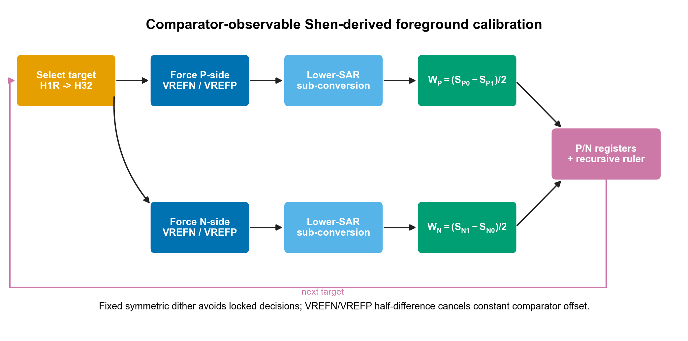

分别估计 P/N 权重，避免用平均权重掩盖分侧 mismatch。

## Fig. 5 — Ideal baseline

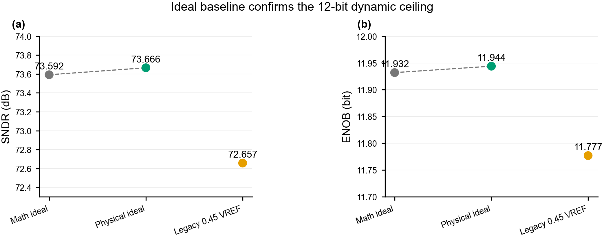

物理 CDAC 与数学理想量化器几乎一致。旧 `0.45 × VREF` 幅度带来约
1.01 dB 损失，但不是掉到约 11.4 bit 的主因。

## Fig. 6 — Dynamic Monte Carlo

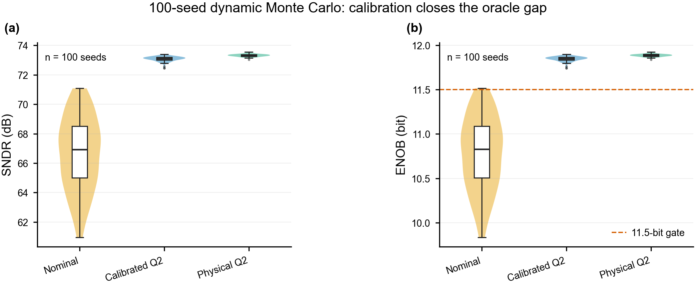

小提琴显示 100 个 seed 的分布，box 显示四分位和中位数。虚线是
11.5-bit 动态门槛。

## Fig. 7 — Q2 output precision

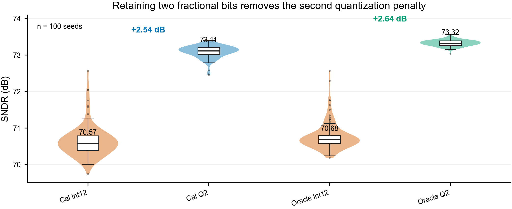

同一批 decisions 使用 integer 与 Q2 重构，校准和 oracle 都恢复约
2.6 dB，证明损失来自共同的末端舍入。

## Fig. 8 — Weight error

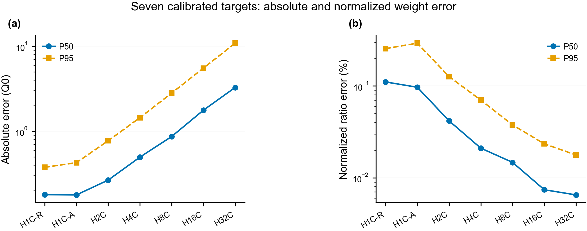

绝对 Q0 误差随递归权重增长，但归一化比例误差向 MSB 方向下降，所以动态
性能仍接近 oracle。

## Fig. 9 — Oracle gap

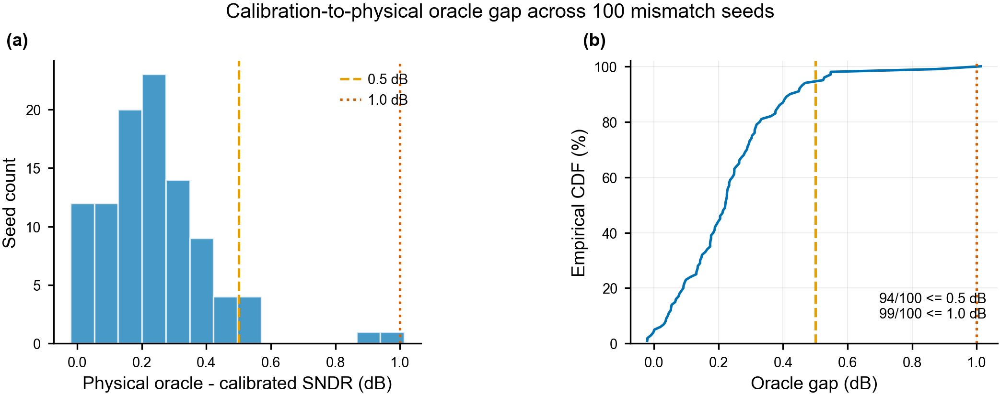

94/100 不超过 0.5 dB；99/100 不超过 1.0 dB。一个约 1 dB 的 tail
样本被保留，没有因 P50 良好而删除。

## Fig. 10 — Static codebook risk

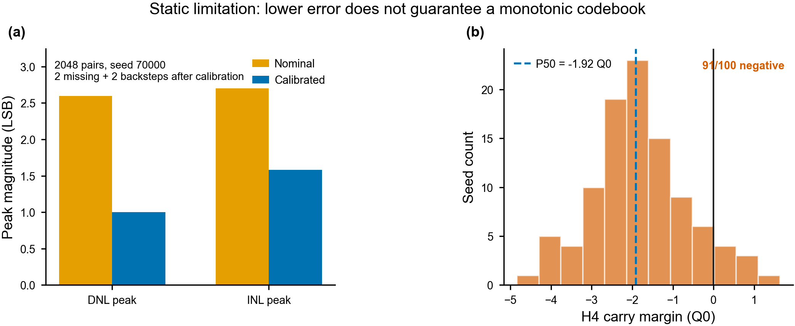

左图说明 DNL/INL 幅度改善不能保证无缺码；右图说明 H4 carry margin
在大多数真实权重样本中为负。

## Fig. 11 — Completion status

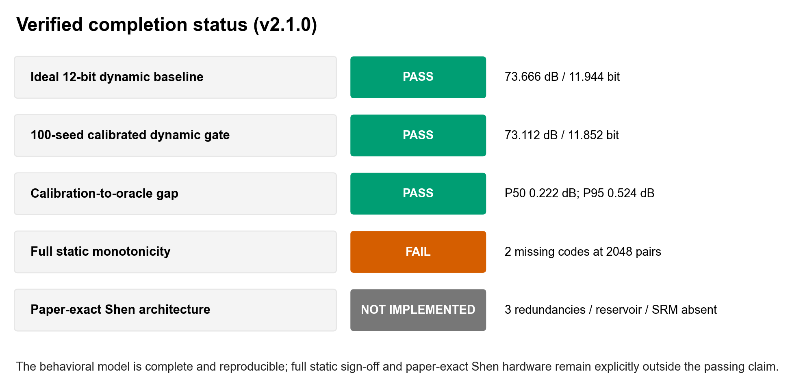

将 PASS、FAIL 和 NOT IMPLEMENTED 放在同一图中，避免把“模型已完成”
误解为“所有规格已通过”。

## 重新生成

```powershell
python -m pip install -e ".[docs]"
python docs\figures\generate_modeling_figures.py
```

CI 可生成到临时目录而不覆盖提交资产：

```powershell
python docs\figures\generate_modeling_figures.py `
  --out-dir .artifacts\figures --formats png svg pdf
```
